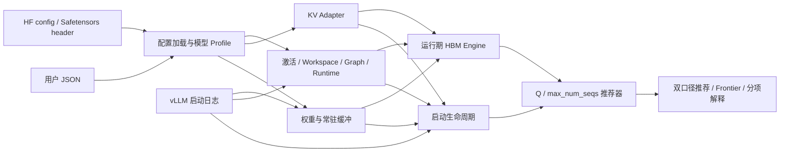

# 架构与扩展说明

## 数据流

## 分层职责

- `config.py`：严格 JSON 合并、模型 Profile、输入校验；
- `capacity.py`：区分标称 HBM、Torch 可见 HBM、启动空闲 HBM；
- `weight_models/`：模型张量放置和模型创建的常驻 buffer；
- `kv/`：不同 KV/状态布局的版本化 Adapter；
- `startup.py`：复现 `vllm serve` 初始化阶段的容量检查；
- `engine.py`：运行期 HBM 汇总；
- `recommender.py`：枚举 Q/S、筛选双重可行域；
- `validation.py`：用成功/失败区间验证理论临界值；
- `output.py`：text、JSON、CSV。

## 为什么使用 KV Adapter

模型的 Cache 结构并不统一：

- 标准 GQA/MHA：K、V 两份张量；
- MLA：压缩 latent 和 RoPE key；
- DeepSeek-V4-Flash：C4、C128、SWA、Indexer 和 Compressor state；
- Attention/SSM 混合模型：KV 与卷积/状态空间缓存并存。

因此通用 Engine 不直接写 KV 公式。每个 Adapter 返回统一的 `KVEstimate`，
同时保留物理 tensor bytes 和 planner capacity。

## 版本化 DSV4 路径

DeepSeek-V4-Flash 包含两个不同口径：

- `deepseek_v4_v023.py`：v0.23 启动最小 KV 准入，使用 22 个 tuple；
- `deepseek_v4_flash.py`：物理 BlockPool，MTP 下 planner 使用 23 个 tuple。

两者来自不同源码路径，不能复用一个 tuple count。v0.20 只支持 block 128；
v0.23 支持 32/64/128，A3/910C 的 block128 页面字节相同。

## 新增模型

1. 在 `profiles.py` 注册结构元数据；
2. 选择通用 GQA/MLA，或在 `kv/` 新增专用 Adapter；
3. 如需 source-exact 权重，在 `weight_models/` 新增张量放置模型；
4. 在 `startup.py` 新增版本锁定的启动检查；
5. 添加几何单测、日志单测和至少一组推荐回归；
6. 在 `MODEL_SUPPORT.md` 标注精度等级。

不要把目标节点的边界值直接写成模型常数。无法从源码确定的项目应通过
`profile_calibration` 显式输入，并保留理论残差。
