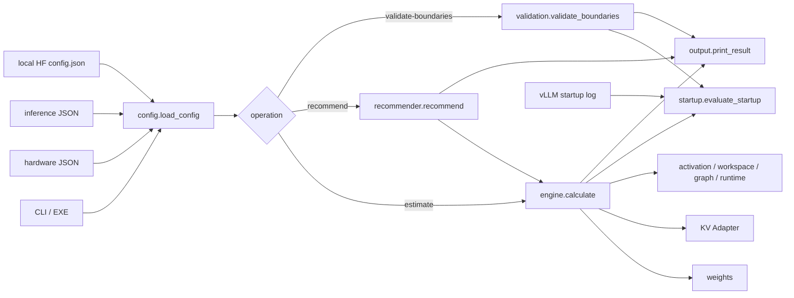
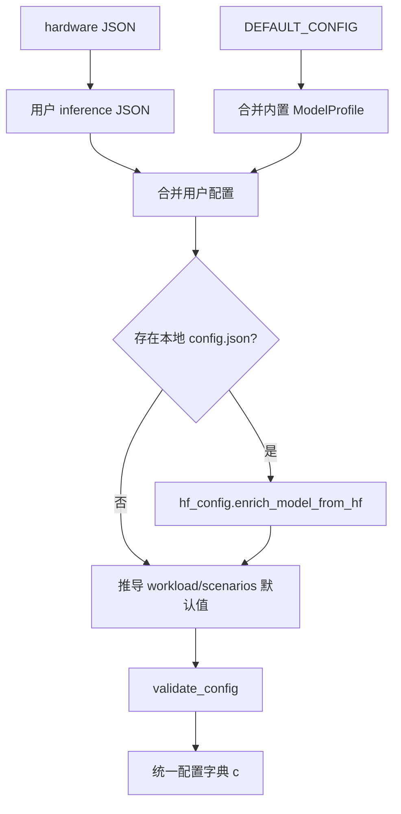
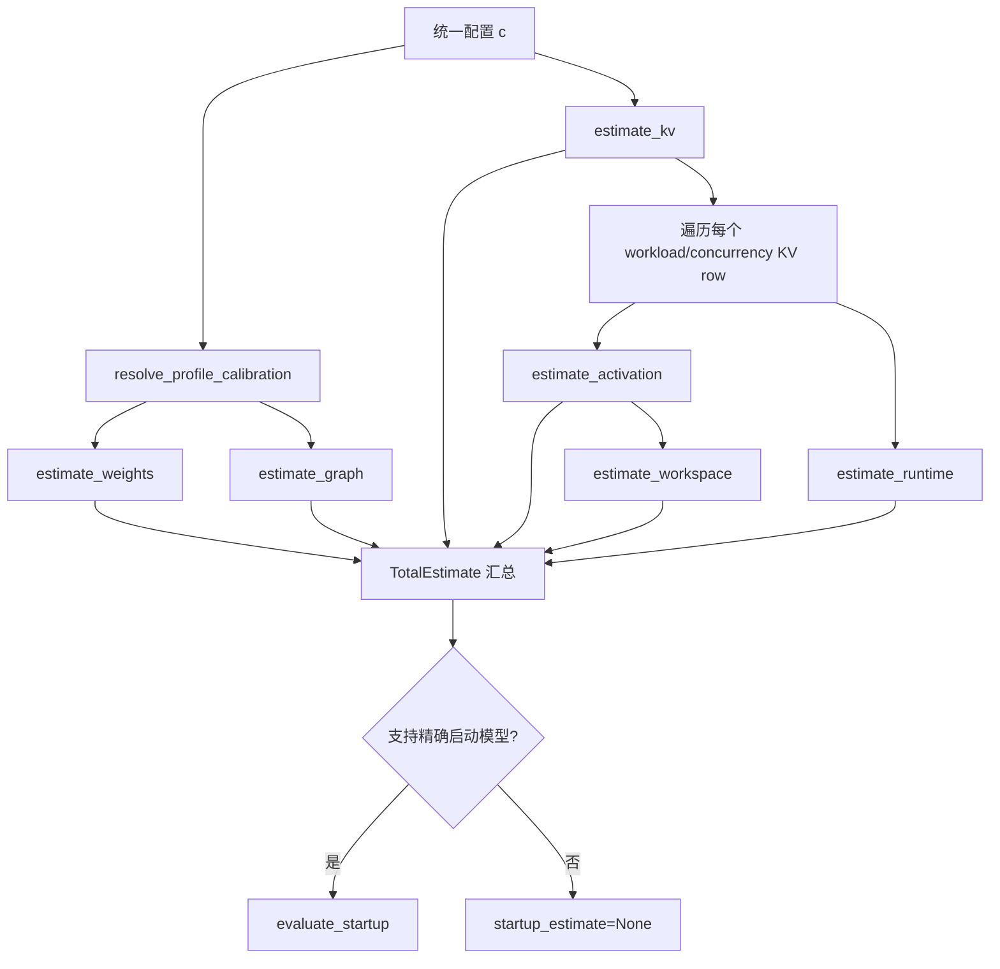

# vLLM Ascend HBM Planner 代码结构说明

本文面向需要阅读、维护和扩展 `vllm-ascend-hbm-planner` 的开发人员，回答以下问题：

- 程序从哪个入口启动；
- JSON 配置如何变成统一的内部配置；
- 权重、KV、激活和其他内存由哪些模块计算；
- “启动极限”和“运行安全”为什么是两条不同的计算链；
- `max_num_batched_tokens` 与 `max_num_seqs` 如何被搜索和推荐；
- 实测启动日志如何参与校准和验证；
- 新模型、新硬件或新版本应该从哪里接入。

本文重点解释代码边界和数据流。具体公式请继续阅读：

- [DeepSeek-V4 v0.23 系统级容量推导](DSV4_V023_KV_CAPACITY_CALCULATION.md)
- [理论建模说明](THEORY_MODELING.md)
- [启动边界验证](DSV4_V023_VALIDATION.md)
- [上游源码定位](UPSTREAM_SOURCES.md)

---

## 1. 项目定位

本项目是一个离线容量规划器。它不启动模型，也不依赖在线访问模型仓库，而是根据：

- 硬件容量和集群拓扑；
- 模型结构、量化方式和本地权重元数据；
- DP、TP、PP、EP、PCP、DCP 等并行参数；
- `max_model_len`、`max_num_batched_tokens`、`max_num_seqs` 等 vLLM 参数；
- 可选的线下启动日志和校准数据；

输出每个逻辑 NPU Rank 的 HBM 分项、容量上界以及推荐参数。

系统有两个容量口径：

1. **启动准入口径**：复现 `vllm serve` 初始化阶段“KV pool 是否至少容纳一个最大长度请求”的检查；
2. **运行安全口径**：把运行期 KV、激活、Workspace、Graph、Runtime、碎片和安全余量合并后判断是否安全。

这两个口径分别对应 `startup.py` 和 `engine.py`，不能用一个总量公式替代。

---

## 2. 仓库目录

```text
vllm-ascend-hbm-planner/
├── pyproject.toml                         # Python 包、版本和 CLI 入口
├── README.md                              # 用户快速开始
├── ARCHITECTURE.md                        # 简版架构与扩展原则
├── MODEL_SUPPORT.md                       # 模型支持和精度等级
├── MIGRATION.md                           # 从原单文件工具迁移
├── vllm_ascend_hbm_calculator.py          # 源码树主启动脚本
├── dsv4_total_hbm_calculator.py           # 旧脚本名兼容入口
│
├── configs/
│   ├── hardware_910c_1node.json           # 独立硬件清单示例
│   ├── deepseek_v4_flash_910c_inference.json
│   │                                        # 独立推理配置示例
│   ├── deepseek_v4_flash_910c.json         # 硬件与推理合并配置
│   ├── *_profiled.json                     # 按拓扑校准的配置
│   ├── dsv4_v023_startup_boundaries.json  # 实测成功/失败边界
│   ├── hf_config_auto.example.json         # 本地 HF config 自动接入
│   └── manual_hybrid_kv.example.json       # 手工 KV Adapter 示例
│
├── src/vllm_ascend_hbm/
│   ├── __main__.py                         # python -m 包入口
│   ├── cli.py                              # 参数解析和 operation 分发
│   ├── config.py                           # JSON 合并、默认值和校验
│   ├── hf_config.py                        # 本地 Hugging Face config 解析
│   ├── profiles.py                         # 内置模型 Profile Registry
│   ├── capacity.py                         # HBM 三种容量口径
│   ├── weights.py                          # 通用权重估计入口
│   ├── weight_models/
│   │   ├── deepseek_v4_w8a8.py             # DSV4 W8A8 模块放置模型
│   │   └── persistent_buffers.py           # MTP、Top-k、RoPE 常驻 Buffer
│   ├── kv/
│   │   ├── __init__.py                     # KV Adapter 分发
│   │   ├── deepseek_v4_v023.py             # DSV4 v0.23 最低启动准入
│   │   ├── deepseek_v4_flash.py            # DSV4 异构物理 BlockPool
│   │   └── homogeneous.py                  # GQA、MLA、manual、none
│   ├── components.py                       # 激活、Workspace、Graph、Runtime
│   ├── logs.py                             # vLLM 启动日志解析
│   ├── startup.py                          # 启动生命周期与最低 KV 检查
│   ├── engine.py                           # 运行期总 HBM 汇总
│   ├── recommender.py                      # Q/S 可行域搜索和评分
│   ├── validation.py                       # 实测成功/失败边界验证
│   ├── output.py                           # text、JSON、CSV 输出
│   ├── types.py                            # 模块间共享结果对象
│   └── utils.py                            # 单位、取整、分配、深度合并
│
├── tests/
│   ├── fixtures/                           # 实测日志和边界数据
│   ├── test_hardware_config.py             # 硬件 JSON 与拓扑校验
│   ├── test_deepseek_v4_w8a8_weights.py    # DSV4 权重分项
│   ├── test_deepseek_v4_v023_kv.py         # 22-tuple 最低 KV
│   ├── test_startup_lifecycle.py           # 启动双口径和日志校准
│   ├── test_dsv4_startup_boundaries.py     # 实测边界回归
│   └── test_planner.py                     # 通用配置、估算和推荐
│
├── packaging/pyinstaller/
│   └── vllm_ascend_hbm.spec                # Windows EXE 打包定义
├── scripts/build_exe.ps1                   # EXE 构建脚本
└── docs/                                   # 建模、验证、使用和汇报资料
```

---

## 3. 总体调用关系



代码组织遵循一个原则：

> 各分项模块只计算自己的内存，`engine.py` 负责汇总，`recommender.py` 负责搜索，不把模型专用公式写进通用搜索器。

---

## 4. 程序入口

项目有四种入口，最终都会调用 `vllm_ascend_hbm.cli.main()`：

| 入口 | 文件或配置 | 用途 |
|---|---|---|
| 安装后的命令 | `pyproject.toml` 中的 `vllm-ascend-hbm` | 标准 CLI |
| 模块运行 | `src/vllm_ascend_hbm/__main__.py` | `python -m vllm_ascend_hbm` |
| 源码树运行 | `vllm_ascend_hbm_calculator.py` | 无需安装包 |
| 兼容入口 | `dsv4_total_hbm_calculator.py` | 兼容旧命令 |

源码树入口只做两件事：

```python
sys.path.insert(0, "<repo>/src")
raise SystemExit(main())
```

业务逻辑全部位于 Python 包中，入口脚本不应该继续堆叠计算公式。

### 4.1 CLI 参数

`cli.py` 支持：

```text
--config
--hardware-config
--operation estimate|recommend
--format text|json|csv
--model-path
--model-config
--profile-log
--validate-boundaries
--list-models
```

CLI 覆盖项在 `load_config()` 之后写入，再调用 `validate_config()` 复验。因此命令行参数能够覆盖 JSON，但仍受统一校验规则约束。

### 4.2 operation 分发

```text
存在 --validate-boundaries
    └─ validation.validate_boundaries()

否则 operation == recommend
    └─ recommender.recommend()

否则
    └─ engine.calculate()
```

最后统一调用：

```python
print_result(result, c["output"]["format"])
```

---

## 5. 配置加载链

配置入口是 `config.load_config(path, hardware_path)`。



### 5.1 合并顺序

逻辑顺序为：

1. 读取推理 JSON；
2. 如果传入独立硬件 JSON，将 `hardware` 内容写入用户配置的 `platform`；
3. 创建 `DEFAULT_CONFIG`；
4. 若 `model.profile != auto`，将内置 Profile 合并到默认模型配置；
5. 将用户配置深度合并到默认配置；
6. 如果有本地 HF `config.json`，只填充仍然缺失的模型字段；
7. 推导 `max_model_len`、workload context 和推荐场景；
8. 执行完整配置校验。

独立硬件 JSON 对同名 `platform` 字段具有权威性，适合调度系统在线注入资源清单；推理 JSON 则描述模型与 vLLM 参数。

### 5.2 相对路径处理

以下路径相对于推理 JSON 所在目录解析：

- `model.config_path`；
- `model.model_path`；
- `profile_calibration.vllm_log_path`。

这样配置文件移动到其他工作目录后仍可稳定解析相邻资源。

### 5.3 配置校验

`validate_config()` 主要检查：

- 模型几何参数是否为正整数；
- KV strategy 是否为 `standard_gqa`、`mla`、`deepseek_v4_flash`、`manual` 或 `none`；
- scheduler 参数是否合法；
- `DP*TP*PP` 是否超过硬件逻辑设备数；
- `physical_cards_per_server*dies_per_card` 是否等于逻辑设备数；
- PCP/DCP 是否不大于且整除 TP；
- EP 是否不超过一个 PP stage 内的 `DP*TP`；
- workload 并发折算到每 DP 后是否超过 `max_num_seqs`；
- Graph、推荐候选、输出格式和手工模型字段是否完整。

校验发生在建模之前，避免下游模块反复处理非法拓扑。

---

## 6. 模型 Profile 与本地 HF 配置

### 6.1 `profiles.py`

`profiles.py` 是内置模型 Registry，保存两类信息：

- `ascend_status`：vLLM Ascend 是否声明支持该模型；
- `modeling_level`：本规划器使用源码级专用模型、通用模型还是手工模型。

这两个概念故意分开：模型能在 Ascend 上运行，不代表其所有 HBM 分项已达到源码级精度。

核心 API：

| API | 作用 |
|---|---|
| `get_profile(name)` | 通过 ID 或别名获取内置 Profile |
| `list_profiles()` | 列出内置模型 |
| `list_auto_families()` | 列出可通过 HF config 自动识别的模型族 |

### 6.2 `hf_config.py`

该模块只读取本地文件，不访问网络。

它负责：

- 定位模型目录下的 `config.json`；
- 对多模态配置提取 `text_config`、`language_config` 或 `llm_config`；
- 映射 hidden、layers、heads、KV heads、expert、MLA 等字段；
- 根据模型结构选择默认 KV strategy；
- 标记是否只建模多模态模型的语言主干。

自动 strategy 规则大致为：

```text
pooling / embedding / reranker -> none
存在 kv_lora_rank             -> mla
Mamba / RWKV / Qwen3-Next     -> manual
其他 Decoder                  -> standard_gqa
```

HF 字段使用 `set_if_missing()` 写入，不覆盖用户已经显式指定的值。

---

## 7. HBM 容量口径

`capacity.resolve_capacity_bytes()` 返回：

```text
(visible_hbm_bytes, startup_free_hbm_bytes, requested_memory_bytes)
```

三者含义不同：

| 字段 | 含义 |
|---|---|
| nominal HBM | 硬件标称容量，如 64 GiB/die |
| visible HBM | Torch/CANN 实际可见容量，如 61.27 GiB |
| startup free HBM | Worker 初始化时仍然空闲的容量 |
| requested memory | `visible HBM * gpu_memory_utilization` |

启动日志中的值优先于静态配置。容量判断不应直接使用标称 64 GiB 替代 61.27 GiB 可见容量。

---

## 8. 权重建模

权重统一入口是：

```python
weights.estimate_weights(c, profile)
```

选择顺序为：

```text
vLLM profile 实测值
    ↓ 没有
手工 per-rank 权重
    ↓ 没有
DSV4 v0.23 W8A8 专用模块放置模型
    ↓ 不适用
本地 Safetensors header 解析
    ↓ 没有模型文件
通用参数量解析模型
```

### 8.1 通用权重路径

`weights.py` 提供：

- `resolve_safetensor_files()`：定位分片和 index；
- `read_safetensor_header()`：只读 header，不加载 tensor payload；
- `parsed_weight_estimate()`：根据 tensor 名称识别 layer、expert、shared expert 和 replicated tensor；
- `analytical_weight_estimate()`：根据总参数量、bit 数及 TP/EP/PP 做通用估计。

### 8.2 DSV4 W8A8 专用路径

`weight_models/deepseek_v4_w8a8.py` 按 vLLM Ascend 模块放置逐项计算：

- Routed Experts 按 EP 切分；
- 特定 Attention 张量按 TP 切分；
- ReplicatedLinear 每 Rank 完整保留；
- Router 同时保留 BF16 与 FP32；
- Compressor 投影按其实际 dtype 计算；
- Shared Expert 是否切分由 `enable_shared_expert_dp` 决定；
- MTP embedding/head alias 按真实引用关系去重；
- 加入 MTP hidden、top-k 和 RoPE 常驻 Buffer。

`persistent_buffers.py` 单独保存 Q 相关的模型 Buffer 公式，使“参数张量”和“模型对象长期持有的 Buffer”保持可区分。

`WeightEstimate.details` 保留所有分项。使用实测权重时，理论值不会丢失，而是同时输出：

```text
theoretical_model_load_bytes
measured_model_load_bytes
measured_residual_bytes
```

---

## 9. KV Adapter

统一入口：

```python
kv.estimate_kv(c)
```

分发规则：

```text
kv_cache_strategy == deepseek_v4_flash
    └─ deepseek_v4_flash.estimate_deepseek_v4()

其他 strategy
    └─ homogeneous.estimate_homogeneous()
```

Adapter 统一返回：

```python
(kv_profile, list[KVEstimate])
```

其中每个 `KVEstimate` 同时提供：

- `physical_pool_tensor_bytes`：实际创建的 KV Tensor 容量口径；
- `planner_total_bytes`：BlockPool Planner 的容量口径；
- `q_tokens_per_rank`：并行切分后的本 Rank Q；
- `details`：历史、SWA、state、page、block 等分项。

### 9.1 通用同构 KV

`homogeneous.py` 处理：

- 标准 GQA/MHA；
- MLA；
- 手工 bytes/token 或 GiB；
- 不需要 KV 的 pooling 模型。

该模块根据并发作用域把全局并发折算到每个 DP engine，并根据 PCP/DCP 计算每 Rank 上下文。

### 9.2 DSV4 异构 KV

`deepseek_v4_flash.py` 建模：

- C4 压缩历史；
- C128 压缩历史；
- SWA；
- C4 compressor state；
- C128 compressor state；
- Indexer；
- Layer tuple 与页面 padding；
- MTP 下的物理 BlockPool。

它根据 workload 模式生成每个请求的 `(query, history, previous)`：

| 模式 | 含义 |
|---|---|
| `fresh` | 从空上下文开始处理当前 Q |
| `late` | 已有较长上下文，再处理当前 chunk |
| `admission` | 保守模拟最大请求准入 |

### 9.3 22 tuple 与 23 tuple

DSV4 v0.23 有两条独立源码路径：

| 文件 | 口径 | tuple count |
|---|---|---:|
| `kv/deepseek_v4_v023.py` | 启动时最低 KV 准入 | 22 |
| `kv/deepseek_v4_flash.py` | MTP 物理 Pool/Planner | 23 |

`deepseek_v4_v023.minimum_kv_admission()` 只判断一个最大长度请求最低需要多少 KV。

`deepseek_v4_flash.estimate_deepseek_v4()` 则计算指定 workload、并发和并行切分下的物理 KV 与 Planner 总量。

二者不能共用 tuple count，也不能用启动准入值替代运行期 Pool。

---

## 10. 激活、Workspace、Graph 与 Runtime

这些分项集中在 `components.py`。

### 10.1 激活

```python
estimate_activation(c, q_tokens, profile)
```

支持：

- DSV4 专用结构模型；
- 通用 Decoder 模型；
- vLLM profile 实测值；
- 手工峰值。

DSV4 激活分解为 persistent hidden、Attention branch 和 MoE branch。Attention 与 MoE 通常不是简单求和，而是根据 branch live fraction 建模重叠生命周期。

启用 FlashComm1 且 `TP>2` 时，DSV4 路径会折算序列并行后的本 Rank 有效 token 数。

### 10.2 Workspace

```python
estimate_workspace(c, activation)
```

优先级为：

```text
已包含在 profile activation 中
    > 手工峰值
    > 已知算子 Workspace 最大值
    > unresolved
```

未知 Workspace 不会被伪装成精确的 0。结果会设置 `unresolved=True`，推荐器再加入显式的 unresolved reserve。

### 10.3 Graph

```python
estimate_graph(c, profile)
```

支持：

- eager：0；
- profile 实测值；
- 手工值；
- capture size 系数模型。

### 10.4 Runtime

```python
estimate_runtime(c, q_tokens, profile)
```

包含：

- input buffers；
- block table；
- sampler logits buffer；
- CANN/HCCL 固定占用；
- 每通信域的双向 HCCL Buffer。

`max_num_seqs` 主要通过 block table 和 sampler 等运行时结构进入该模块。

### 10.5 不确定性

`uncertainty_bounds()` 对每个分项应用自己的不确定性比例，输出 lower/upper bound，并计算高可信分项占总量的比例。

---

## 11. 运行期总 HBM：`engine.calculate()`

`engine.py` 是分项汇总器，不直接保存模型专用公式。

调用顺序：



核心总量：

```text
actual_total
  = weights
  + physical KV tensor
  + activation
  + workspace
  + graph
  + runtime
  + fragmentation
  + safety reserve

planning_total
  = actual_total
  - physical KV tensor
  + KV planner capacity
```

因此：

- `actual_total_bytes` 更接近实际 Tensor 占用中心估计；
- `planning_total_bytes` 使用更保守的 Planner KV 口径；
- `upper_bound_bytes` 表示考虑各分项不确定性后的上界；
- `coverage_complete` 表示是否仍有未解析的 Workspace。

一个配置可产生多条 `TotalEstimate`，因为 workload 可以遍历多个并发值。

---

## 12. 启动准入：`startup.evaluate_startup()`

该函数模拟 `vllm serve` 的初始化容量检查。

输入：

```python
evaluate_startup(config, q, seqs, log_text=None)
```

主要步骤：

1. 深拷贝配置并覆盖候选 Q/S；
2. 读取显式日志或 `profile_calibration.vllm_log_path`；
3. 解析 visible、free、requested、weight、activation、non-Torch、Graph 和 KV 字段；
4. 理论计算 DSV4 W8A8 model load；
5. 如果有实测值，用实测基线加理论 Q 增量；
6. 计算或校准 profile activation；
7. 计算 available KV；
8. 调用 `minimum_kv_admission(L,Q,B)`；
9. 比较 `minimum_kv_bytes <= available_kv_bytes`。

启动 available KV 口径为：

```text
requested - model_load - profile_activation - non_torch
```

Graph 在 profile 之后捕获，因此不会从这一步的 available KV 中重复扣除；Graph 是否完成单独记录为 `graph_capture_passed`。

当前 `startup_model_supported()` 自动启用精确启动模型的条件是：

```text
kv_cache_strategy == deepseek_v4_flash
vllm_ascend_version starts with 0.23
block_size == 128
```

`startup_feasible=True` 表示当前已建模的启动门槛通过，不等同于证明所有后续算子和 Graph 阶段绝不会 OOM。

---

## 13. 参数推荐：`recommender.recommend()`

推荐器搜索二维候选空间：

```text
candidate_max_num_batched_tokens
    ×
candidate_max_num_seqs
```

并对每个业务场景分别计算。

### 13.1 单个候选

`_candidate()` 会：

1. 检查 `Q >= max_num_seqs`；
2. 把候选写入临时配置；
3. 把场景 context 和并发设置为“每个 DP engine 的 S 个请求”；
4. 调用 `engine.calculate()`；
5. 获取运行期 `TotalEstimate`；
6. 获取启动期 `StartupEstimate`；
7. 对未知 Workspace 加 reserve；
8. 把 KV 不确定性应用到 physical/planner 口径；
9. 检查最小 headroom；
10. 同时判断 startup gate 和 runtime budget。

候选安全条件：

```text
runtime_safe
  = startup_gate_passed
  and runtime_budget_safe
```

### 13.2 评分

`candidate_score()` 对 Q 和 S 做对数归一化，再按目标加权：

| objective | Q 权重倾向 | S 权重倾向 |
|---|---:|---:|
| `prefill_throughput` | 高 | 低 |
| `concurrency` | 低 | 高 |
| `balanced` | 使用配置权重 | 使用配置权重 |

评分只用于在可行候选中排序，不能让不满足内存条件的候选变成可行。

### 13.3 推荐结果

返回结果区分：

- `startup_limit_recommended`：只看启动准入的极限候选；
- `runtime_safe_recommended`：所有场景均通过运行安全检查的推荐；
- `single_service_recommended`：统一服务覆盖所有场景的推荐；
- `frontier_by_max_num_seqs`：固定 S 时最大可行 Q；
- `frontier_by_max_num_batched_tokens`：固定 Q 时最大可行 S；
- `closest_infeasible`：距离可行域最近的失败候选。

这使使用者既能看到推荐值，也能看到 Q/S 可行域边界。

---

## 14. 实测边界验证：`validation.py`

验证输入是一组：

```text
max_model_len
DP
TP
max_num_seqs
observed max success Q
observed first fail Q
```

对每一行，`validate_boundaries()`：

1. 复制基础配置；
2. 覆盖 L、DP、TP、S；
3. 选择对应 TP 的离线 calibration；
4. 调用 `_maximum_feasible_q()` 二分搜索理论临界 Q；
5. 判断理论值是否落入实测半开区间 `[success, first_fail)`；
6. 反推未建模内存的上下界；
7. 汇总命中率和到实测区间的距离。

`_maximum_feasible_q()` 先倍增搜索失败上界，再二分查找最后一个 `startup_feasible=True` 的 Q。

边界值没有硬编码回理论模型。实测数据用于验证和显式 calibration，而不是隐藏成为经验常数。

---

## 15. 日志解析：`logs.py`

`parse_startup_log()` 将稳定日志字段转换为 `ParsedStartupLog`：

```text
startup_free_gib
visible_hbm_gib
gpu_memory_utilization
requested_memory_gib
weight_gib
activation_gib
non_torch_gib
graph_gib
current_kv_gib
required_kv_gib
available_kv_gib
estimated_max_model_len
graph_capture_finished
```

解析器不负责推导，只负责从文本中提取事实。如何使用这些事实由 `startup.py` 和 `components.py` 决定。

这一边界很重要：新增日志格式时应修改 `logs.py`，不应把正则散落在计算模块中。

---

## 16. 核心结果对象

`types.py` 定义模块之间的稳定结果结构。

| 类型 | 生产者 | 主要消费者 | 含义 |
|---|---|---|---|
| `TensorRecord` | `weights.py` | Safetensors 权重估计 | 单个 tensor header |
| `WeightEstimate` | `weights.py` / `weight_models` | `engine.py`、`startup.py` | 每 Rank 模型加载内存 |
| `ActivationEstimate` | `components.py` | `engine.py`、Workspace | 激活峰值及分支分解 |
| `ComponentEstimate` | `components.py` | `engine.py` | Workspace、Graph、Runtime 通用结果 |
| `KVEstimate` | KV Adapter | `engine.py` | 一条并发场景的物理/Planner KV |
| `TotalEstimate` | `engine.py` | 推荐器、输出层 | 运行期完整 HBM 结果 |
| `StartupEstimate` | `startup.py` | 推荐器、验证器、输出层 | 启动最低 KV 准入结果 |

结果对象保存 `source`、`details` 和 `uncertainty_fraction`，目的是让每个数字可追溯，而不是只输出一个总 GiB。

---

## 17. 输出层

`output.print_result()` 根据格式和 operation 分发：

```text
json                    -> json.dumps
csv                     -> print_csv
validate boundaries     -> 验证表格
recommend               -> 推荐结果表格
estimate                -> 内存分项表格
```

原则上，计算模块返回字节整数和结构化字典；GiB 格式化和面向人的文本展示放在 `output.py`。

JSON 是最完整的机器接口，文本适合人工检查，CSV 适合批量比较。

---

## 18. 三条主要调用链

### 18.1 固定配置估算

```text
CLI
└─ load_config
   └─ calculate
      ├─ resolve_profile_calibration
      ├─ estimate_weights
      ├─ estimate_graph
      ├─ estimate_kv
      ├─ estimate_activation
      ├─ estimate_workspace
      ├─ estimate_runtime
      ├─ uncertainty_bounds
      └─ evaluate_startup（受支持时）
```

### 18.2 Q/S 推荐

```text
CLI
└─ load_config
   └─ recommend
      ├─ 遍历 scenario
      ├─ 遍历 Q × S
      │  └─ _candidate
      │     └─ calculate
      ├─ startup gate
      ├─ runtime safety gate
      ├─ score/sort
      └─ 生成统一推荐和 Frontier
```

### 18.3 启动边界验证

```text
CLI
└─ load_config
   └─ validate_boundaries
      ├─ 覆盖每行拓扑和 L
      ├─ 选择 topology calibration
      ├─ 倍增搜索 Q 上界
      ├─ 二分搜索最大可启动 Q
      └─ 与 [success, first_fail) 比较
```

---

## 19. 测试结构

测试按模块边界组织：

| 测试文件 | 覆盖内容 |
|---|---|
| `test_hardware_config.py` | 独立硬件 JSON、覆盖优先级和拓扑约束 |
| `test_deepseek_v4_w8a8_weights.py` | EP/TP 放置、Router 副本、MTP/Top-k/RoPE Buffer |
| `test_deepseek_v4_v023_kv.py` | DSV4 v0.23 最低 KV 页数和 22 tuple |
| `test_startup_lifecycle.py` | 日志解析、available KV、Graph 生命周期和校准外推 |
| `test_dsv4_startup_boundaries.py` | 九组实测成功/失败边界 |
| `test_planner.py` | Profile、HF config、通用 KV、总量和推荐输出 |

典型验证命令：

```powershell
$env:PYTHONPATH = "src"
python -m unittest discover -s tests -v
python -m compileall -q src
```

修改某个模型 Adapter 时，至少应同时验证：

1. 几何和页面的确定性单测；
2. 一个成功日志；
3. 一个失败日志；
4. 推荐结果或边界回归。

---

## 20. Windows EXE 打包

打包链为：

```text
scripts/build_exe.ps1
    └─ PyInstaller
       └─ packaging/pyinstaller/vllm_ascend_hbm.spec
          └─ vllm_ascend_hbm.cli:main
```

EXE 和 Python CLI 复用同一包代码，不维护第二份业务实现。

详细用法见 [EXE_USAGE.md](EXE_USAGE.md)。

发布包应由 Git tag 对应提交重新构建，不在源码目录保存历史 ZIP、wheel 和重复源码快照。

---

## 21. 新增模型的推荐路径

### 21.1 标准 GQA/MHA 或 MLA

优先使用现有通用路径：

1. 在 `profiles.py` 注册稳定几何，或者使用 `profile=auto`；
2. 通过本地 HF `config.json` 填充结构字段；
3. 复用 `kv/homogeneous.py`；
4. 使用 Safetensors header 或通用参数量权重模型；
5. 通过实测补充 activation、Workspace、Graph 和 non-Torch。

### 21.2 新的异构 Cache 模型

如果模型包含 Attention/SSM 混合缓存、压缩 state 或专用 page layout：

1. 在 `kv/` 新建专用 Adapter；
2. 返回统一 `KVEstimate`；
3. 分开 raw、physical tensor 和 planner capacity；
4. 在 `kv/__init__.py` 增加 strategy 分发；
5. 添加版本、block size 和硬件布局测试。

不要强行套用普通 GQA 的 bytes/token 公式。

### 21.3 新的源码级权重模型

如果通用参数量或 Safetensors 切分不能解释加载日志：

1. 在 `weight_models/` 新增模型文件；
2. 按 vLLM 模块逐类区分 replicated、TP-sharded、EP-sharded 和 alias；
3. 单独建模加载后 dtype 副本和模型常驻 Buffer；
4. 在 `weights.estimate_weights()` 增加选择条件；
5. 输出理论值、实测值和残差，不隐藏拟合量。

### 21.4 新的启动准入版本

启动检查必须绑定版本，因为 vLLM/vLLM Ascend 的 page 和 tuple 规则可能变化：

1. 新增版本化最低 KV 模块；
2. 在 `startup_model_supported()` 增加精确适用条件；
3. 不复用物理 Pool tuple 数，除非上游源码明确相同；
4. 用成功/失败相邻边界验证理论临界 Q。

---

## 22. 排查结果偏差的入口

当预测与实测不一致时，建议按下列顺序定位。

### 22.1 启动即报最低 KV 不足

查看：

```text
startup.py
kv/deepseek_v4_v023.py
capacity.py
logs.py
```

比较：

```text
available_kv_bytes
minimum_kv_bytes
computed_available_kv_bytes
reported_required_kv_bytes
```

### 22.2 日志中的 weights 差距大

查看：

```text
weights.py
weight_models/deepseek_v4_w8a8.py
weight_models/persistent_buffers.py
```

重点检查：

- EP size 是否正确；
- Shared Expert 是否启用 DP；
- Router 是否存在 FP32 副本；
- Q 相关 MTP、Top-k、RoPE Buffer；
- embedding/head 是否 alias；
- 实测与理论 residual。

### 22.3 不同 TP 的 activation 偏差大

查看：

```text
components.estimate_activation
vllm_ascend.enable_flashcomm1
parallelism.tp_size
profiled_max_num_batched_tokens
```

确认实测 calibration 是否来自同一 TP 和同一 Q。

### 22.4 运行时推荐过于乐观

查看：

```text
operator_workspace.unresolved
unresolved_workspace_reserve_gib_per_rank
minimum_headroom_gib_per_rank
fit_basis
uncertainty
```

优先补充 Workspace/Graph 实测，不要直接把边界 Q 写成经验常数。

### 22.5 大规模集群不一致

规划器输出是每 Rank 值。集群层面还应检查：

- 每个 PP stage 的实际层分布；
- 每个 Rank 的专家映射；
- 通信域数量与 HCCL Buffer；
- 节点间可见 HBM 是否一致；
- 最小容量 Rank 是否成为全局限制；
- calibration 是否按硬件、版本、TP/EP 拓扑分桶。

---

## 23. 现有代码边界与已知限制

当前设计有意保留以下边界：

- DSV4 W8A8 精确权重模型要求 `PP=1`；
- DSV4 v0.23 自动启动准入目前限定 `block_size=128`；
- 通用模型的 Workspace 和 Graph 未必能够仅凭 config 精确确定；
- 多模态自动解析只建模语言主干，视觉/音频激活需要额外数据；
- Hybrid Attention/SSM 不能安全套用同构 GQA 模型；
- `startup_feasible` 表示已建模门槛通过，不代表未建模算子阶段绝对不会失败；
- 线性 Q 外推适合邻近校准点，不应无限远外推；
- 所有核心容量按单逻辑 NPU Rank 输出，不应直接当作整机总量。

这些限制应通过 `source`、`notes`、`unresolved_components` 和校准字段显式展示，而不是被隐藏。

---

## 24. 阅读顺序建议

### 24.1 只想知道命令如何执行

```text
README.md
→ cli.py
→ config.py
→ output.py
```

### 24.2 想理解启动成功/失败

```text
startup.py
→ capacity.py
→ logs.py
→ weight_models/deepseek_v4_w8a8.py
→ kv/deepseek_v4_v023.py
```

### 24.3 想理解运行期总 HBM

```text
engine.py
→ weights.py
→ kv/__init__.py
→ components.py
→ types.py
```

### 24.4 想理解参数推荐

```text
recommender.py
→ engine.py
→ startup.py
→ output.py
```

### 24.5 想接入新模型

```text
MODEL_SUPPORT.md
→ profiles.py
→ hf_config.py
→ kv/homogeneous.py 或新 KV Adapter
→ weights.py 或新 weight model
→ tests/
```

---

## 25. 总结

整个仓库可以归纳成五层：

```text
入口层
  CLI、EXE、JSON

配置与模型识别层
  config、profiles、hf_config

确定性分项层
  weights、weight_models、kv、components、capacity

决策层
  startup、engine、recommender、validation

表达与验证层
  types、output、tests、docs
```

最关键的代码边界是：

1. 模型专用公式留在 Adapter 或 weight model 中；
2. `engine.py` 只汇总，不复制模型公式；
3. `startup.py` 和运行期 `engine.py` 保持双口径；
4. `recommender.py` 只搜索已经计算好的可行域；
5. 实测数据通过显式 calibration 和 validation 进入，不成为隐藏常数；
6. 所有结果保留来源、分项、残差和不确定性，使推荐能够解释和复核。
