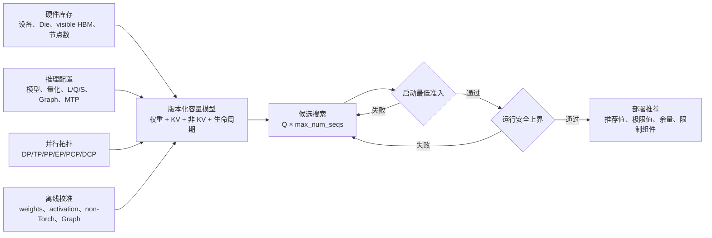
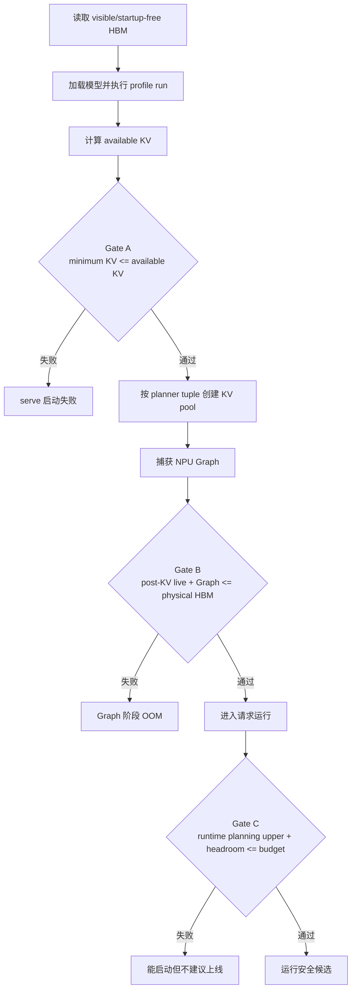

# DeepSeek-V4-Flash / vLLM Ascend v0.23 HBM 容量建模：从系统预算到 KV 页面

本文不是只回答“一个 token 的 KV 有多大”，而是从**部署推荐系统**的角度回答下面三个逐级收敛的问题：

1. 给定硬件、模型、并行拓扑和 vLLM Ascend 参数，服务能否完成 `vllm serve` 启动？
2. 即使服务能够启动，Graph 捕获和真实请求运行时是否仍有足够 HBM？
3. 在满足容量约束的候选中，应推荐怎样的 `max_num_batched_tokens` 和 `max_num_seqs`？

全文采用“系统总览 → 生命周期与总公式 → 组件模型 → DSV4 KV 源码级推导 → 实测校准 → 集群化推荐”的顺序展开。这样既能在前几节建立完整认知，也能继续向下追踪到 page、block、layer tuple 和代码实现。

本文的默认参考场景为：

- 硬件：Ascend 910C / Atlas 800 A3，按逻辑 NPU die 计量；
- 模型：DeepSeek-V4-Flash W8A8，启用 1 层 MTP；
- 软件：`vllm-ascend==0.23.0rc1`；
- 默认 KV 布局：`block_size=128`，无 PCP/DCP；
- 容量单位：除非特别说明，均为每个逻辑 NPU/die；
- 实测边界：主要观察 `vllm serve` 能否启动，运行安全需要额外的真实请求压测。

## 0. 系统级总览

### 0.1 系统要解决的不是单个公式，而是一条部署决策链

从调度系统看，HBM 推荐不是“把模型参数量除以卡数，再加一份 KV”这么简单。它是一条带有阶段、拓扑和置信度的决策链：



系统最终输出的不是一个孤立的 Q，而是一个可解释的决策：

- 哪个 `max_num_batched_tokens` 可以启动；
- 哪个 Q/S 组合适合真实业务；
- 当前限制来自权重、KV、activation、Graph、Workspace 还是通信；
- 与下一个失败候选相差多少 HBM；
- 每个内存组件来自源码公式、模型结构、日志实测还是工程保守项。

### 0.2 三个系统平面

为了避免配置、计算和决策相互混杂，可以把系统拆成三个平面。

| 平面 | 主要职责 | 典型内容 |
|---|---|---|
| 输入与资产平面 | 描述客观资源和期望部署 | 硬件 JSON、模型 config、vLLM 参数、并行策略、业务场景 |
| 容量计算平面 | 生成各阶段、各 rank 的容量需求 | 权重放置、KV adapter、activation、HCCL、Graph、Workspace、校准 profile |
| 决策平面 | 搜索候选并执行容量门槛 | startup minimum、runtime upper、worker-min、headroom、Q/S frontier |

仓库中的双 JSON 也遵循这个边界：

- 硬件 JSON 保存设备型号、服务器数、逻辑 Die 数和可见 HBM 等稳定事实；
- 推理 JSON 保存模型、版本、并行拓扑、`gpu_memory_utilization`、L/Q/S 和运行开关；
- 校准日志或 topology profile 是可选的第三类数据，用于覆盖无法静态确定的非 KV 部分。

`gpu_memory_utilization` 属于部署策略，不是硬件属性；`visible_hbm_gib_per_die` 属于运行环境事实，不应隐藏在模型 profile 中。

### 0.3 必须同时区分三个维度

容量数字只有同时带上**作用范围、生命周期和证据等级**才有意义。

#### 维度一：作用范围

| 范围 | 解释 |
|---|---|
| per rank / per logical die | 单个 worker 是否 OOM，是主要容量判断口径 |
| per DP engine | scheduler 的 Q/S 和本地并发口径 |
| per PP stage | 权重、层数和 KV tuple 可能不均衡，必须取最重 stage |
| whole cluster | 资源成本和吞吐能力，不能代替单 rank OOM 判断 |

例如 DP 会复制模型和 KV pool。整机 HBM 会随 DP 增长，但单个请求的 KV 不会因为 DP 增大而缩小。最终 BlockPool 数量还可能由并行组中容量最小的 worker 决定。

#### 维度二：生命周期

| 阶段 | 主要存活对象 | 主要问题 |
|---|---|---|
| 模型加载 | 权重、量化元数据、模型持久 buffer | 模型能否加载 |
| Profile run | 权重、峰值 activation、部分 workspace、non-Torch | 还剩多少 available KV |
| Minimum admission | available KV 与单个最大请求最低 KV | `serve` 是否被准入检查拒绝 |
| KV pool 创建 | 全局 BlockPool tensor | 能创建多少 global block |
| Graph capture | KV pool、模型常驻对象、Graph 内存 | Graph 捕获是否 OOM |
| 请求运行 | live KV/state、activation、workspace、runtime buffer | 真实业务是否安全 |

不同阶段的峰值对象不一定同时存活。把启动日志中的所有数字直接相加，是最常见的重复计费错误之一。

#### 维度三：证据等级

| 等级 | 示例 | 使用方式 |
|---|---|---|
| source-exact | DSV4 v0.23 minimum KV 页面公式 | 直接用于准入边界 |
| tensor/structure-aware | W8A8 权重放置、通用 activation | 给出中央值和不确定性 |
| measured | non-Torch、Graph、kernel Workspace | 按 topology signature 校准 |
| engineering reserve | 碎片、未知 Workspace、安全余量 | 只作为显式保守项 |

理论和校准不是二选一。正确关系是：理论模型负责可解释的结构，实测数据只覆盖无法静态确定的残差。

### 0.4 启动生命周期和三道容量门槛

系统级计算按时间顺序执行，而不是只做一次总和。



#### Gate A：启动最低准入

首先定义 vLLM 目标预算：

$$
M_{requested}=M_{visible}\times U
$$

Profile 后可供 KV 使用的容量：

$$
M_{availableKV}
=M_{requested}
-M_{model-load}
-M_{profile-activation}
-M_{nonTorch}
$$

启动最低准入条件：

$$
M_{minKV}(L,Q,B)\le M_{availableKV}
$$

这道门只回答：KV pool 是否至少能容纳一个 `max_model_len` 请求所需的最低页面。

#### Gate B：KV pool 与 Graph 的物理阶段

通过准入后，planner 用 available KV 反推 global block 数：

$$
N_{blocks}
=\left\lfloor
\frac{M_{availableKV}}
{S_{planner/block}}
\right\rfloor
$$

实际创建的 KV tensor 为：

$$
M_{KV-physical}
=N_{blocks}\times S_{physical/block}
$$

Graph 在 KV pool 之后捕获，所以需要单独验证当时仍存活的物理对象，而不能在 `available KV` 中提前扣一次、之后再重复加一次。

#### Gate C：运行安全上界

运行期中央值：

$$
\begin{aligned}
M_{runtime-central}
=&M_{model-load}
+M_{KV-physical}
+M_{activation-live}\\
&+M_{workspace-peak}
+M_{graph}
+M_{runtime-persistent}\\
&+M_{fragmentation}
+M_{safety}
\end{aligned}
$$

容量规划时把物理 KV 替换为更保守的 planner 口径：

$$
M_{runtime-planning}
=M_{runtime-central}
-M_{KV-physical}
+M_{KV-planner}
$$

线上推荐通常使用上界而不是中央值：

$$
M_{planning-upper}
+M_{unresolved-workspace-reserve}
+M_{minimum-headroom}
\le M_{requested}
$$

因此，**启动成功是必要条件，不是运行安全的充分条件**。

### 0.5 总 HBM 的组件树

从所有权看，单 rank HBM 可以拆为以下组件：

```text
HBM / logical rank
├─ Model load
│  ├─ checkpoint tensors / quantization metadata
│  ├─ TP/EP/PP placement residual
│  └─ MTP、RoPE、top-k 等模型持久 buffer
├─ KV subsystem
│  ├─ minimum admission KV
│  ├─ planner BlockPool
│  ├─ physical KV tensors
│  └─ runtime live KV/state
├─ Compute live set
│  ├─ profile/runtime activation
│  └─ operator workspace
├─ Runtime infrastructure
│  ├─ HCCL/CANN/non-Torch
│  ├─ NPU Graph
│  └─ input、block table、sampler metadata
└─ Risk allowance
   ├─ allocator fragmentation
   ├─ component uncertainty
   └─ safety/headroom reserve
```

这些组件不能一律按相同方式建模：

- KV 页面和 safetensors payload 可以接近确定性计算；
- 权重 rank placement 与 activation 依赖模型结构和并行拓扑；
- CANN、Graph、Workspace 和通信域需要版本化实测；
- 碎片和安全余量应作为独立、可见、可调整的工程项。

### 0.6 KV 子系统的三个不同答案

即使只看 KV，也不存在唯一的“KV 容量”：

1. **最低启动准入容量**：vLLM 是否允许服务继续初始化；
2. **KV pool 规划/物理容量**：available memory 最终生成多少 BlockPool tensor；
3. **运行时 live KV/state 容量**：给定请求长度、并发和 chunk 后实际占用多少块。

三者来自不同源码路径，使用不同的每 global block 等价字节数。本文后续将具体解释为什么同一场景可能同时出现 `49.0 GiB`、`51.0 GiB` 和 `51.3 GiB`，而它们都不是计算错误。

### 0.7 分级阅读路线

后文按三层展开：

- **确定性内核层（第 1～12 节）**：从 DSV4 cache 类型、page 和 layer tuple 推导 minimum/planner/physical/live KV；
- **完整单 rank 容量层（第 13～22 节）**：推导权重、activation、Workspace、通信、Graph、runtime 和总 HBM 生命周期；
- **集群与产品化层（第 23～26 节）**：解释多种并行策略、64/128 卡以上 topology signature、离线校准和线上推荐输出。

如果只需要快速判断系统结论，可以先阅读本节和文末第 27 节；如果需要复现日志中的 `17.26 GiB`，继续阅读第 1～8 节；如果需要实现部署推荐器，则应完整阅读第 13～25 节。

> **展开层级一：下面先进入 DSV4 KV 的确定性内核。** 这一层解释最容易被误解、同时又最能由源码精确确定的 page、block 和 layer tuple。

## 1. 输入参数和符号

| 符号 | vLLM 参数或模型常量 | 含义 |
|---|---|---|
| $L$ | `max_model_len` | 单请求最大序列长度 |
| $Q$ | `max_num_batched_tokens` | 单个 DP engine 一次调度最多处理的 token 数 |
| $S$ | `max_num_seqs` | 单个 DP engine 同时调度的最大序列数 |
| $B$ | `block_size` | vLLM 逻辑 block 大小，v0.23 支持 32/64/128 |
| $W$ | 模型 `sliding_window` | DSV4-Flash 中为 128 |
| $R_4$ | C4 压缩率 | 4 个原始 token 形成 1 个 C4 历史项 |
| $R_{128}$ | C128 压缩率 | 128 个原始 token 形成 1 个 C128 历史项 |
| $N_{MTP}$ | `mtp_layers` | 本场景为 1 |

DP、TP、EP、PP、PCP、DCP 的影响并不相同：

- DP 复制模型和 KV pool，但把全局请求分散到多个 DP engine；本文所有公式先按一个 DP engine、一个逻辑 rank 计算；
- TP/EP 会改变权重、激活、通信和 available KV，但 DSV4 的异构 KV 页面不能简单按 TP 等比例相除；
- PCP 会切分 prefill token/state，DCP/PCP 会切分历史上下文；
- PP 需要按每个 stage 实际承载的层重新计算 layer tuple，不能直接用完整模型的 22/23 常量。

因此，本文的 22/23 tuple 结论只适用于当前 DSV4-Flash 单 stage 布局。扩展到 PCP/DCP/PP 时必须重新走版本化适配器。

## 2. 为什么一个 global block 不是一个 KV tensor

DSV4-Flash 同时包含多种缓存：

- C4 压缩历史 KV；
- C128 压缩历史 KV；
- SWA 局部窗口 KV；
- C4 主 compressor state；
- C4 indexer compressor state；
- C128 compressor state；
- MTP 层缓存。

vLLM Ascend 不为这些缓存分别维护完全独立的 block ID 空间，而是把不同 page-size bucket 组织为统一的 layer tuple。一个 global block ID 因而对应一组页面，不是单一 KV tensor。

官方实现先按 page size 对层分桶，再把小页面 padding 到 full-MLA group 定义的 canonical page size；随后以最长 bucket 深度作为 layer tuple 数。源码见：

- [KV group 分组与页面 padding](https://github.com/vllm-project/vllm-ascend/blob/v0.23.0rc1/vllm_ascend/patch/platform/patch_kv_cache_utils.py#L946-L1017)
- [DeepSeek-V4 KV tensor 规划](https://github.com/vllm-project/vllm-ascend/blob/v0.23.0rc1/vllm_ascend/patch/platform/patch_kv_cache_utils.py#L1090-L1158)

## 3. canonical page 的字节数

### 3.1 `block_size=128`

大页面来自 512 维 BF16 MLA/SWA 数据：

$$
S_{large}=128\times512\times2=131072\ \text{B}
$$

小页面在当前布局中表现为每 entry 130 B：

$$
S_{small}=128\times130=16640\ \text{B}
$$

因此一个 canonical layer tuple 的大小为：

$$
S_{tuple}=S_{large}+S_{small}=131072+16640=147712\ \text{B}
$$

不同 state 的原始页面还会被对齐到这两个 canonical bucket：

| 缓存 | 内部 block | 原始 page | 分配 page | 说明 |
|---|---:|---:|---:|---|
| MLA/SWA | 128 | 131072 B | 131072 B | large bucket |
| C4 main state | 8 | 65536 B | 131072 B | padding 100% |
| C4 index state | 8 | 16384 B | 16640 B | padding 256 B |
| C128 state | 32 | 131072 B | 131072 B | large bucket |

其中 C4 main state 的页面 padding 是临时 state 容量显著放大的主要来源之一。

### 3.2 v0.23 的其他 block size

| CLI `block_size` | C4 state block | C128 state block | small page | large page | canonical tuple |
|---:|---:|---:|---:|---:|---:|
| 128 | 8 | 32 | 16640 B | 131072 B | 147712 B |
| 64 | 4 | 16 | 8320 B | 65536 B | 73856 B |
| 32 | 2 | 8 | 4160 B | 32768 B | 36928 B |

block size 减半时，单页字节数约减半，但同一序列所需页面数约翻倍。因此它主要改变尾块碎片和 cache 粒度，不会让总容量按 1/2 或 1/4 成比例下降。

## 4. 22、23 和 Physical 三种口径

### 4.1 最低启动准入：22 个 tuple

DSV4-Flash 的最低 KV 准入检查使用 22 个 canonical layer tuple：

$$
S_{min/block}=22\times147712=3249664\ \text{B}
$$

即每个“最低准入 global block 等价单位”约为：

$$
3249664/2^{20}=3.0991\ \text{MiB}
$$

这里的 22 已经包含层维度，不能再乘 43 或 44 层。它来自统一后各 cache group 的最大 bucket 深度；例如 SWA specs 被拆分、对齐成两个 22 深度的 group，其他 group 也按这一深度对齐。

### 4.2 pool planner：23 个 tuple

启用 1 层 MTP 时，物理 pool planner 先把 MTP 加入 allocation tuple 深度：

$$
N_{planner}=22+N_{MTP}=23
$$

所以 planner 在反推可创建的 global block 数时使用：

$$
S_{planner/block}=23\times147712=3397376\ \text{B}
$$

$$
N_{blocks}
=\left\lfloor
\frac{M_{available\ KV}}
{3397376}
\right\rfloor
$$

这对应官方源码中的核心关系：

```python
page_sizes = sorted(full_mla_spec.get_page_sizes())
layer_tuple_page_bytes = sum(page_sizes)
num_layer_tuples = max_bucket_depth + len(mtp_layer_names)
num_blocks = available_memory // (
    layer_tuple_page_bytes * num_layer_tuples
)
```

上面的代码是对官方实现的等价摘写，省略了分桶、override 和 tensor 创建细节。

### 4.3 真实 KV tensor：MTP 只创建 large page

MTP 层实际只创建一个 large-page tensor，而不是完整的 large+small tuple。因此真实物理 tensor 的每 global block 字节数是：

$$
S_{physical/block}
=22\times147712+1\times131072
=3380736\ \text{B}
$$

planner 与真实 tensor 的差值为：

$$
S_{planner/block}-S_{physical/block}
=3397376-3380736
=16640\ \text{B}
$$

恰好是一张 small page。这个差值会随 global block 数累计。

### 4.4 三个值不能混用

| 口径 | 每 global block 等价字节 | 用途 |
|---|---:|---|
| Minimum admission | 3249664 B | 启动时“至少一个最大长度请求”的准入检查 |
| Planner | 3397376 B | available memory 反推 `num_blocks` |
| Physical tensor | 3380736 B | 实际创建的 KV tensor 总字节 |

`Minimum admission` 最小，`Planner` 最大。服务通过最低启动准入，不代表同一组 $L/Q$ 在真实请求阶段一定具有充足的 physical/planner 容量。

## 5. 最低启动准入的五类页面

下面的公式与仓库中的 `minimum_kv_admission()` 保持一致。

### 5.1 C4 历史页面

一个逻辑 block 含 $B$ 个 C4 entry，每个 entry 覆盖 4 个原始 token：

$$
P_{C4H}=\left\lceil\frac{L}{4B}\right\rceil
$$

当 $B=128$ 时，一个 C4 history page 覆盖 $4\times128=512$ 个原始 token。

### 5.2 C128 历史页面

$$
P_{C128H}=\left\lceil\frac{L}{128B}\right\rceil
$$

当 $B=128$ 时，一个 C128 history page 覆盖 $128\times128=16384$ 个原始 token。

### 5.3 SWA 页面

SWA window 为 $W=128$。当前 prefill chunk 需要考虑窗口尾部和本轮 $Q$ 个 token，同时不能超过最大序列长度：

$$
T_{SWA}=\min(W-1+Q,L)
$$

每个 SWA group 的页面数为：

$$
P_{SWA,one}
=\left\lceil\frac{T_{SWA}}{B}\right\rceil+1
$$

DSV4 布局中存在两个 SWA group：

$$
P_{SWA}=2P_{SWA,one}
$$

### 5.4 C4 compressor state 页面

C4 state 的内部 block size 为 $B/16$；当 $B=128$ 时为 8。状态窗口使用 7 个尾 token 加本轮 $Q$：

$$
P_{C4S}
=\left\lceil
\frac{\min(7+Q,L)}{8}
\right\rceil+1
$$

C4 main state 与 C4 index state 属于同一个 block-size group。组容量按两者所需页面数的最大值计算，而不是把两者页面数相加；每个 tuple 内已经同时包含 large/small bucket 的字节成本。

### 5.5 C128 compressor state 页面

C128 state 的内部 block size 为 $B/4$；当 $B=128$ 时为 32：

$$
P_{C128S}
=\left\lceil
\frac{\min(127+Q,L)}{32}
\right\rceil+1
$$

公式中的 `+1` 是源码容量边界中的额外 block。它不表示多了一个 token，而是 block/state 边界所需的保守页。

### 5.6 页面合计

$$
P_{total}
=P_{C4H}+P_{C128H}+P_{SWA}+P_{C4S}+P_{C128S}
$$

$P_{total}$ 是五类 cache group 的 global block 等价数量之和，不是 token 数。

最低启动准入容量为：

$$
M_{minKV}
=P_{total}\times22\times(S_{large}+S_{small})
$$

当 $B=128$ 时：

$$
M_{minKV}=P_{total}\times22\times147712
$$

## 6. 与仓库实现等价的 Python 代码

仓库实现位于 `src/vllm_ascend_hbm/kv/deepseek_v4_v023.py`。核心计算可简化为：

```python
from math import ceil


def dsv4_v023_minimum_kv_bytes(
    max_model_len: int,
    max_num_batched_tokens: int,
    block_size: int = 128,
) -> int:
    layouts = {
        128: (8, 32, 16_640, 131_072),
        64: (4, 16, 8_320, 65_536),
        32: (2, 8, 4_160, 32_768),
    }
    c4_state_block, c128_state_block, small_page, large_page = (
        layouts[block_size]
    )

    L = max_model_len
    Q = max_num_batched_tokens
    B = block_size

    c4_history = ceil(L / (4 * B))
    c128_history = ceil(L / (128 * B))

    swa_one = ceil(min(127 + Q, L) / B) + 1
    swa_total = 2 * swa_one

    c4_state = ceil(
        min(c4_state_block - 1 + Q, L) / c4_state_block
    ) + 1
    c128_state = ceil(
        min(127 + Q, L) / c128_state_block
    ) + 1

    total_pages = (
        c4_history
        + c128_history
        + swa_total
        + c4_state
        + c128_state
    )
    return total_pages * 22 * (small_page + large_page)
```

实际仓库代码使用整数 `ceildiv`，避免浮点除法在大整数上的精度问题。

## 7. 32K / Q=47104 的逐项复算

输入：

```text
L = 32768
Q = 47104
B = 128
W = 128
```

由于 $Q>L$，SWA 和 compressor state 的有效 token 数都被 $L$ 截断。

### 7.1 各类页面

$$
P_{C4H}=\left\lceil\frac{32768}{512}\right\rceil=64
$$

$$
P_{C128H}=\left\lceil\frac{32768}{16384}\right\rceil=2
$$

$$
P_{SWA}=2\times
\left(
\left\lceil\frac{32768}{128}\right\rceil+1
\right)
=514
$$

$$
P_{C4S}=\left\lceil\frac{32768}{8}\right\rceil+1=4097
$$

$$
P_{C128S}=\left\lceil\frac{32768}{32}\right\rceil+1=1025
$$

所以：

$$
P_{total}=64+2+514+4097+1025=5702
$$

### 7.2 最低启动准入容量

$$
\begin{aligned}
M_{minKV}
&=5702\times22\times147712\\
&=18529584128\ \text{B}\\
&=17.2570199966\ \text{GiB}
\end{aligned}
$$

日志四舍五入显示为 `17.26 GiB`，与实测失败日志精确对应：

```text
17.26 GiB KV cache is needed
available KV cache memory: 17.2 GiB
```

因此，这一失败点不需要经验拟合，最低 KV 公式可以由源码和输入参数直接复现。

## 8. 为什么 Q=45056 成功、Q=47104 失败

在 $L=32768$ 时，只要 $Q$ 已经超过 state/window 的截断边界，各 state 页数就不会继续增长。因此：

```text
Q=45056 的 minimum KV = 17.257 GiB
Q=47104 的 minimum KV = 17.257 GiB
```

失败并不是最低 KV 需求继续增大，而是更大的 $Q$ 使 profile run 的激活、workspace 或 non-Torch 峰值增加，留给 KV pool 的 available memory 下降。

成功日志可复算：

$$
M_{availableKV}
=55.14-27.17-7.27-3.08
\approx17.62\ \text{GiB}
$$

日志的 `Current KV cache memory` 为 `17.63 GiB`，与扣减结果一致，并高于 `17.257 GiB`，所以最低准入通过。

失败配置的 available KV 降到约 `17.2 GiB`，低于 `17.257 GiB`，因此在 serve 启动阶段直接失败。

注意：该 available KV 口径来自启动 profile 阶段的权重、activation 和 non-Torch 扣减。Graph 在后续阶段捕获，需要另做 graph 后物理余量检查，不能在同一个公式里重复扣除。

## 9. 1M 上下文下 Q 的影响

最低启动准入口径的示例：

| $L$ | $Q$ | $P_{total}$ | Minimum admission |
|---:|---:|---:|---:|
| 1048576 | 10240 | 3883 | 11.752 GiB |
| 1048576 | 81920 | 16203 | 49.038 GiB |

当 $Q=81920$ 时，各页面为：

```text
C4 history        2048
C128 history        64
2 × SWA            1284
C4 state          10242
C128 state         2565
P_total           16203
```

同一个 $P_{total}=16203$ 若换成 MTP 物理/规划口径：

| 口径 | 计算 | 容量 |
|---|---|---:|
| Minimum | $16203\times3249664$ | 49.038 GiB |
| Physical | $16203\times3380736$ | 51.016 GiB |
| Planner | $16203\times3397376$ | 51.267 GiB |

这解释了为什么有时会同时看到“最低 KV 约 49 GiB”和“规划 KV 约 51.3 GiB”两个结果：它们回答的是不同问题，都可能是正确的，但不能互换。

## 10. 并发和切分策略如何进入运行时模型

最低启动准入只检查一个最大长度请求，不直接乘 `max_num_seqs`。运行时 live KV/state 则需要对每个本地活跃序列分别计算页面，再求和：

$$
P_{live,total}=\sum_{s=1}^{S_{local}}P_{total}(L_s,Q_s)
$$

其中：

- $S_{local}$ 是每个 DP engine 的本地并发，不是整机全局并发；
- scheduler 会把本轮 $Q$ 分配给多个请求，因此每个请求的 $Q_s$ 不一定相同；
- 每个请求的历史长度 $L_s$ 也可能不同；
- 对 page 数逐请求取整后再求和，不能先把所有 token 合并后只取整一次。

然后分别得到：

$$
M_{live,physical}=P_{live,total}\times S_{physical/block}
$$

$$
M_{live,planner}=P_{live,total}\times S_{planner/block}
$$

切分策略需要在计算页面前作用到 token/history：

- PCP：近似把单 rank 的 prefill $Q$ 除以 `pcp_size`，再按本地 block size 取整；
- DCP×PCP：近似把压缩历史长度分散到对应 context parallel ranks；
- DP：把全局请求分配到 DP engines，但不会缩小单请求的模型和 KV 页面；
- TP：主要通过权重、activation、HCCL、Graph 改变 available KV，DSV4 cache 不应直接除以 TP；
- PP：必须按 stage 的真实层集合重新求 page bucket 和 tuple 深度。

因此，部署推荐器需要同时输出：

- `required_min_kv_bytes`：最低启动准入；
- `allocated_kv_pool_bytes`：实际创建的 pool tensor；
- `planner_kv_bytes`：BlockPool 容量判断；
- `runtime_live_kv_bytes`：业务场景 live KV/state；
- `available_kv_bytes`：由权重、activation、non-Torch 等扣减后的可用预算。

## 11. 如何在仓库中复现

运行单元测试：

```powershell
cd D:\code\chatgpt\LLM_inference\vllm-ascend-hbm-planner
$env:PYTHONPATH = "src"
python -m unittest tests.test_deepseek_v4_v023_kv -v
```

直接调用计算函数：

```powershell
$env:PYTHONPATH = "src"
python -c "from vllm_ascend_hbm.kv.deepseek_v4_v023 import minimum_kv_admission as f; r=f(32768,47104,128); print(r); print(r.total_bytes/2**30)"
```

关键实现和测试：

- `src/vllm_ascend_hbm/kv/deepseek_v4_v023.py`：v0.23 最低准入公式；
- `src/vllm_ascend_hbm/kv/deepseek_v4_flash.py`：physical/planner/live KV 模型；
- `tests/test_deepseek_v4_v023_kv.py`：32K/17.26 GiB 回归测试；
- `configs/dsv4_v023_startup_boundaries.json`：九组实测启动边界。

## 12. KV 小结与建模边界

本文可以从输入参数确定或高精度推导：

- DSV4 v0.23 页面尺寸和 padding；
- 五类页面数；
- minimum/planner/physical 三种 KV 口径；
- $L/Q/B$ 变化造成的确定性 KV 变化；
- DP/PCP/DCP 对本地 token 和历史长度的切分关系。

以下部分仍需通过线下节点 profile 校准，不能伪装成纯理论精确值：

- 不同 TP/EP/PP 拓扑下的 per-rank 权重加载差异；
- peak activation；
- CANN kernel workspace；
- non-Torch/HCCL 常驻与峰值；
- NPU Graph capture；
- 分配器碎片和版本相关常量。

因此，服务启动推荐应使用“双口径”：

1. 用源码等价 `minimum KV` 判断启动准入边界；
2. 用 `physical/planner + 非 KV 上界 + 安全余量` 判断运行安全边界。

只满足第一条，意味着 `serve` 可能启动；同时满足第二条，才适合推荐为线上运行参数。

---

> **展开层级二：从 KV 内核扩展到完整单 rank HBM。** 第 13～22 节按启动生命周期依次加入权重、activation、通信、Workspace、Graph、运行时缓冲和风险余量，并明确哪些对象不能同时计费。

## 13. 总 HBM 模型与启动生命周期

### 13.1 先区分 nominal、visible、startup-free 和 requested

一块逻辑 die 的容量至少存在四个不同口径：

| 口径 | 示例 | 含义 |
|---|---:|---|
| nominal HBM | 64 GiB | 硬件规格标称容量 |
| visible HBM | 61.27 GiB | `torch.npu`/运行时实际可见容量 |
| startup-free HBM | 60.89 GiB | vLLM 进程初始化后、加载模型前的空闲容量 |
| requested memory | 55.14 GiB | `visible × gpu_memory_utilization` |

本例的请求预算必须按 visible HBM 计算：

$$
M_{requested}
=M_{visible}\times U
=61.27\times0.9
\approx55.143\ \text{GiB}
$$

不能直接使用 $64\times0.9=57.6$ GiB，否则会高估约 2.46 GiB 的可用预算。只有拿不到 visible HBM 时，工具才回退到配置中的 `hbm_gib_per_die`。

对应实现：`src/vllm_ascend_hbm/capacity.py`。

### 13.2 vLLM profile 的三类非 KV 内存

vLLM 的 memory profiler 把用于 KV 预算扣减的非 KV 内存归纳为：

1. `weights_memory`：模型加载后常驻的 Torch 内存；
2. `torch_peak_increase`：profile forward 相对基线增加的 Torch 峰值；
3. `non_torch_increase`：从创建实例到 profile 后增加的非 Torch 内存。

官方 memory profiler 的原则是：持久 Torch 分配已经包含在实际消耗中，只额外加入 transient peak headroom，避免把已常驻的 Tensor 再算一次。参考 [vLLM MemoryProfiler](https://docs.vllm.ai/en/latest/api/vllm/utils/mem_utils/)。

在当前 vLLM Ascend 日志口径下，可写成：

$$
M_{availableKV}
=M_{requested}
-M_{model-load}
-M_{profile-activation}
-M_{nonTorch}
$$

Graph 不在这一步重复扣除。它在 KV pool 规划后捕获，属于后续生命周期阶段。

### 13.3 启动过程不能压缩成一个求和式

推荐器按顺序检查以下阶段：

| 阶段 | 主要动作 | 容量判断 |
|---|---|---|
| A | 加载模型并执行 profile run | 计算 `available KV` |
| B | 最低 KV 准入检查 | `minimum KV <= available KV` |
| C | 按 available memory 创建 KV pool | page/tuple/block 取整 |
| D | 捕获 FULL_DECODE_ONLY NPU Graph | 检查物理 HBM 是否仍有空间 |
| E | 真实请求运行 | 检查 live activation/workspace/KV 上界 |

阶段 A～B 的启动门限：

$$
M_{minKV}(L,Q,B)
\le
M_{requested}-M_{load}(Q)-M_{act-profile}(Q,S)-M_{nonTorch}
$$

阶段 D 的物理条件应写成：

$$
M_{postKV-live}+M_{graph}
\le M_{startup-free}
$$

这里不能把 `profile peak activation` 机械地与所有持久内存相加，因为 profile peak 中的临时 Tensor 在创建 KV pool 前会被释放；需要使用该阶段真实仍存活的 Tensor 集合。

### 13.4 运行期保守总量

仓库的运行安全模型使用：

$$
\begin{aligned}
M_{actual}
=&M_{load}
+M_{KV-physical}
+M_{activation}
+M_{workspace}\\
&+M_{graph}
+M_{runtime}
+M_{fragmentation}
+M_{safety}
\end{aligned}
$$

BlockPool 规划口径用 planner KV 替换 physical KV：

$$
M_{planning}
=M_{actual}-M_{KV-physical}+M_{KV-planner}
$$

运行推荐不能只判断 `M_planning <= requested`，还要叠加未知 Workspace 占位和最小余量，后文第 20 节详述。

## 14. 权重与模型加载常驻内存

### 14.1 日志中的 weights 不只是 checkpoint payload

`Actual usage: ... for weights` 更准确的名称应是 `model-load persistent memory`。它包含：

- 模型 Parameter；
- 量化 scale、offset 和加载后派生副本；
- FP32 router/compressor 参数；
- embedding、LM head、MTP 参数；
- RoPE 全长 cache；
- MTP hidden、top-k、RoPE runtime 等由模型构造阶段创建的持久 buffer；
- 格式转换、对齐及少量未公开加载残差。

因此不能只用：

$$
\frac{P_{total}\times1\ \text{B}}{TP}
$$

估算 DeepSeek-V4-Flash W8A8。

### 14.2 本模型使用的结构常量

| 常量 | 数值 |
|---|---:|
| hidden size $H$ | 4096 |
| MoE intermediate $I$ | 2048 |
| routed experts $E$ | 256 |
| shared experts | 1 |
| 主层数 | 43 |
| MTP 层数 | 1 |
| vocabulary $V$ | 129280 |
| attention heads $A$ | 64 |
| head dim $D$ | 512 |
| query compression dim $R_q$ | 1024 |
| output groups $G_o$ | 8 |
| output intermediate $R_o$ | 1024 |
| indexer heads | 64 |
| indexer head dim | 128 |
| mHC expansion | 4 |

总层计数：

$$
N_L=43+1=44
$$

当前精确适配器要求 `pp_size=1`。PP>1 时应按每个 stage 的真实 Tensor 列表计算，不能把总量平均除以 PP。

对应实现：`src/vllm_ascend_hbm/weight_models/deepseek_v4_w8a8.py`。

### 14.3 W8A8 dynamic linear 的单层公式

对输入维度 $d_{in}$、输出维度 $d_{out}$ 的 W8A8 dynamic linear，工具计入：

- INT8 weight：$d_{in}d_{out}$ B；
- BF16 scale：$2d_{out}$ B；
- BF16 offset：$2d_{out}$ B；
- post-load FP32 scale copy：$4d_{out}$ B。

所以：

$$
M_{dyn-linear}(d_{in},d_{out})
=d_{in}d_{out}+8d_{out}
$$

这个公式说明 W8A8 并不等于“每个矩阵元素固定 1 B 后结束”；按输出通道保存的量化元数据和加载后副本必须计入。

### 14.4 routed expert

FusedMoE 中 W13 包含 gate+up，W2 是 down projection，因此单专家 INT8 主权重为：

$$
M_{expert-weight}=3HI
$$

代码额外计入 scale/offset 和 FP32 scale copy：

$$
M_{expert-meta}=(2I+H)\times4+2I\times4
$$

每个 EP rank 的本地专家数：

$$
E_{local}=\frac{E}{EP}
$$

于是：

$$
M_{routed}
=N_L\times E_{local}
\times(M_{expert-weight}+M_{expert-meta})
$$

在 $EP=16$ 时，每个 rank 有 16 个 routed experts；该项约 16.532 GiB/rank，且在 TP1/TP2/TP4 三种拓扑中基本不变。它按 EP 切分，不能再除以 TP。

### 14.5 shared expert

单个 shared expert 的模型加载字节：

$$
M_{shared-one}=3HI+(2I+H)\times8
$$

若开启 `enable_shared_expert_dp=true`，shared expert 在 rank 上复制：

$$
M_{shared}=N_L\times N_{shared}\times M_{shared-one}
$$

否则当前模型按 TP 分片：

$$
M_{shared}=\frac{N_LN_{shared}M_{shared-one}}{TP}
$$

本配置开启 shared expert DP，因此约 1.034 GiB/rank，不随 TP 减小。

### 14.6 attention 参数

每层 replicated attention 参数包含：

$$
M_{attn-repl/layer}
=M_{dyn-linear}(H,R_q)
+M_{dyn-linear}(H,D)
$$

它们在每个 TP rank 上都存在：

$$
M_{attn-repl}=N_LM_{attn-repl/layer}
$$

当前结果约 0.258 GiB/rank。

TP-sharded attention 使用：

$$
Q_{out}=AD
$$

$$
W_{oa,in}=\frac{AD}{G_o},\qquad
W_{oa,out}=G_oR_o
$$

代码中的单层近似为：

$$
\begin{aligned}
M_{attn-TP/layer}
=&M_{dyn-linear}\left(R_q,\frac{Q_{out}}{TP}\right)\\
&+\left[
W_{oa,in}\frac{W_{oa,out}}{TP}
+\frac{W_{oa,out}}{TP}H
\right]\times2
\end{aligned}
$$

该项在 TP1/TP2/TP4 下分别约为 6.886、3.443、1.721 GiB，呈近似 $1/TP$ 变化。

attention norm 与 sink 还需：

$$
M_{norm+sink}
=N_L(2R_q+2D+4A)
$$

### 14.7 compressor、indexer、router 与 mHC

#### Compressor

对压缩层组 $(N,ratio,overlap)$，令：

$$
d_{out}=overlap\times D
$$

代码按以下公式计入 compressor：

$$
M_{compressor-group}
=N\left[
2Hd_{out}\times4
+ratio\times d_{out}\times4
+D\times2
\right]
$$

两个组分别为 `(21, 4, 2)` 和 `(20, 128, 1)`。compressor projection 被量化描述标记为 FLOAT，因此这里使用 4 B，而不是 INT8。总计约 0.974 GiB/rank。

#### Indexer

令：

$$
d_{index}=64\times128,\qquad d_{comp}=2\times128
$$

C4 indexer 的结构估计为：

$$
\begin{aligned}
M_{indexer}=21[&M_{dyn-linear}(R_q,d_{index})
+H\times64\times2\\
&+2Hd_{comp}\times4
+4d_{comp}\times4
+128\times2]
\end{aligned}
$$

约 0.340 GiB/rank。

#### Router

router 同时保留原 BF16 参数和 `weight_fp32`：

$$
M_{router-weight/layer}=HE(2+4)
$$

前三层还包含 vocabulary 相关 FP32 表，其余层包含 expert correction bias；MTP 层也有独立 router。最终约 0.267 GiB/rank。

#### mHC

令 $C=4$、$H_C=CH$、$mix=(2+C)C$，单层 mHC 估计：

$$
M_{mHC/layer}
=2\times mix\times H_C\times4
+2\times mix\times4
+2\times3\times4
$$

再加模型级别的 mHC 参数，总计约 0.129 GiB/rank。

### 14.8 embedding、LM head 和 MTP

target embedding 与 LM head 按 TP 分片：

$$
M_{target-embed+head}
=\frac{2V H\times2}{TP}
$$

MTP 保留自己的 embedding；加载完成后若 MTP LM head 与 target head 相等，则共享 target head，不再保留重复 head：

$$
M_{MTP-embedding}=\frac{N_{MTP}VH\times2}{TP}
$$

所以：

$$
M_{embedding/head}
=\frac{(2+N_{MTP})VH\times2}{TP}
$$

TP1/TP2/TP4 下约为 2.959、1.479、0.740 GiB。

MTP projection 和 norm：

$$
M_{MTP-proj/norm}
=N_{MTP}(2H^2\times2+4H\times2)
$$

约 0.063 GiB/rank。

### 14.9 模型构造阶段的 Q 相关持久 buffer

这些 buffer 在模型构造/加载阶段创建，因此被 vLLM 记入 `weights`，不能再放进普通 activation。

#### MTP hidden buffer

$$
M_{MTP-hidden}=Q\times C\times H\times b
$$

其中 $C=4$、$H=4096$、$b=2$ B。

#### Top-k buffer

$$
M_{topk}=Q\times K_{index}\times4
$$

$K_{index}=512$。target 和 draft 初始都可能构造引用，但 proposer 会让 draft 引用 target buffer，并在 profiler 记录前释放重复 buffer，因此只保留一份。

#### RoPE 全长 cache

普通 RoPE 与 compressed RoPE 各维护一套 FP32 cos/sin table：

$$
M_{RoPE-full}
=2\times L_{position}\times D_{rope}\times4\times2
$$

当 $L_{position}=1048576$、$D_{rope}=64$ 时恰为 1 GiB/rank。该项不随 TP 减少。

#### RoPE runtime buffers

模型存在 4 个 runtime group：普通 default，以及 compressed default/C4/C128：

$$
M_{RoPE-runtime}
=4\times Q\times D_{rope}\times4\times2
$$

#### 合计

$$
M_{model-buffer}
=M_{MTP-hidden}+M_{topk}+M_{RoPE-full}+M_{RoPE-runtime}
$$

TP2、$Q=45056$ 时约为 2.547 GiB，其中仅 MTP hidden 就约 1.375 GiB。这个机制解释了为什么即使 $Q>L$ 后最低 KV 进入平台，日志中的 weights 仍可能随 $Q$ 增长。

### 14.10 理论权重与实测权重

三种拓扑的结果：

| TP | Q | 理论 model-load | 日志 weights | 日志－理论 |
|---:|---:|---:|---:|---:|
| 1 | 23552 | 31.251 GiB | 31.760 GiB | +0.509 GiB |
| 2 | 45056 | 27.066 GiB | 27.170 GiB | +0.104 GiB |
| 4 | 39936 | 24.430 GiB | 24.260 GiB | -0.170 GiB |

TP2 闭合最好。TP1/TP4 的差异可能来自 ACL format padding、加载阶段峰值/释放时机、shared expert overlap、allocator 统计口径等。负残差不应被强行截为零，它同样是模型近似或日志口径差异的证据。

TP2、EP16、$Q=45056$ 的 27.066 GiB 理论值可进一步拆成：

| model-load 分项 | GiB/rank |
|---|---:|
| routed experts | 16.532 |
| shared expert | 1.034 |
| TP-sharded attention | 3.443 |
| replicated attention | 0.258 |
| compressor | 0.974 |
| indexer | 0.340 |
| router | 0.267 |
| mHC | 0.129 |
| embedding/head | 1.479 |
| MTP projection/norm | 0.063 |
| MTP hidden + top-k + RoPE buffers | 2.547 |
| norm、sink 等小项 | 约 0.001 |
| **理论合计** | **27.066** |

这张表也说明增加 TP 不能让总 model-load 按比例下降：16.532 GiB routed experts、1.034 GiB shared expert、compressor、indexer、router、mHC 和 RoPE 等大部分分项并未按 TP 分片。

若在参考 $Q_0$ 有实测 weights，候选 $Q$ 使用：

$$
M_{load}(Q)
=M_{measured}(Q_0)
+M_{theory}(Q)-M_{theory}(Q_0)
$$

这样既保留实测基线，又不丢失模型持久 buffer 随 $Q$ 的确定性变化。

### 14.11 其他模型的权重估计层级

当没有 DSV4 source-specific 适配器时，工具按以下优先级处理：

1. vLLM profile 实测 per-rank weights；
2. 手工 per-rank 值；
3. 解析 safetensors header；
4. 按参数量和量化位宽进行结构估算。

Safetensors header 的 `data_offsets` 可以精确统计 checkpoint payload，但 rank placement 仍需根据 Tensor 名称推断：

$$
M_{rank,stage}
=\left(
\frac{M_{expert}}{EP}
+\frac{M_{sharded}}{TP}
+M_{replicated}
\right)
\times(1+f_{overhead})\times f_{PP-imbalance}
$$

PP 取最大 stage，而不是取平均 stage。该通用方法无法自动推断所有 post-load 副本和设备格式 padding，因此可信度低于 DSV4 专用适配器。

## 15. Profile activation 峰值

### 15.1 activation 是峰值 live-set，不是逐层求和

Transformer 层依次执行，大多数临时 Tensor 会在层间复用或释放。如果把 44 层所有 activation 相加，会严重高估。

结构模型把 activation 分为：

- 始终需要保留的 persistent hidden/mHC buffer；
- attention 分支峰值；
- MoE 分支峰值；
- 两个分支可能重叠的比例。

最终：

$$
M_{act,theory}
=M_{persistent}
+f_{live}\times\max(M_{attention},M_{MoE})
$$

默认 `branch_live_fraction=0.70`。它是结构估计系数，不是 vLLM 源码中的精确常量。

对应实现：`src/vllm_ascend_hbm/components.py`。

### 15.2 FlashComm1 下的有效 token

若启用 FlashComm1：

$$
Q_{eff}=
\begin{cases}
Q,&TP\le2\\
\left\lceil\frac{2Q}{TP}\right\rceil,&TP>2
\end{cases}
$$

因此 TP4 时 $Q_{eff}=Q/2$；TP1 不会因为公式中的 2 而被放大。

### 15.3 persistent hidden 与 mHC

令 activation dtype 字节为 $b=2$：

$$
M_{hidden-one}=Q_{eff}Hb
$$

mHC residual：

$$
M_{mHC-residual}=M_{hidden-one}\times C
$$

hidden I/O buffers：

$$
M_{hidden-IO}=M_{hidden-one}\times n_{hidden-buffer}
$$

默认 `hidden_buffer_count=3`，所以：

$$
M_{persistent}=M_{mHC-residual}+M_{hidden-IO}
$$

### 15.4 attention 分支

本地 head 数按 TP 向上取整：

$$
A_{local}=\left\lceil\frac{A}{TP}\right\rceil
$$

$$
A_{index,local}=\left\lceil\frac{A_{index}}{TP}\right\rceil
$$

$$
G_{out,local}=\left\lceil\frac{G_o}{TP}\right\rceil
$$

各项：

$$
M_{attn-Q}=Q_{eff}A_{local}Db
$$

$$
M_{compressed-Q}=Q_{eff}R_qb
$$

$$
M_{indexer-Q}=Q_{eff}A_{index,local}D_{index}b
$$

$$
M_{grouped-output}=Q_{eff}G_{out,local}R_ob
$$

top-k selection 同时保存 int32 index 和一个 activation dtype 值：

$$
M_{sparse-topk}=Q_{eff}K_{index}(4+b)
$$

所以：

$$
M_{attention}
=M_{attn-Q}+M_{compressed-Q}+M_{indexer-Q}
+M_{grouped-output}+M_{sparse-topk}
$$

### 15.5 MoE 分支

每个 token 路由到 $K_E=6$ 个 experts：

$$
T_{routed}=Q_{eff}K_E
$$

router logits 使用 FP32：

$$
M_{router-logits}=Q_{eff}E\times4
$$

dispatch buffer：

$$
M_{dispatch}
=T_{routed}Hb\times n_{dispatch-copy}
$$

expert intermediate：

$$
M_{expert-intermediate}
=T_{routed}Ib\times n_{intermediate-buffer}
$$

加入 MoE capacity factor：

$$
M_{MoE}
=f_{capacity}\left(
M_{router-logits}+M_{dispatch}+M_{expert-intermediate}
\right)
$$

默认：

```text
moe_dispatch_buffer_copies = 2
moe_intermediate_buffer_count = 2
moe_capacity_factor = 1.10
```

### 15.6 三种 TP 的理论与实测

| TP | Q | $Q_{eff}$ | 理论 activation | 日志 activation | 残差 |
|---:|---:|---:|---:|---:|---:|
| 1 | 23552 | 23552 | 3.766 GiB | 4.740 GiB | +0.974 GiB |
| 2 | 45056 | 45056 | 7.204 GiB | 7.270 GiB | +0.066 GiB |
| 4 | 39936 | 19968 | 3.193 GiB | 3.380 GiB | +0.187 GiB |

TP2 示例的结构拆分：

```text
persistent hidden/mHC   2.406 GiB
attention branch        2.277 GiB
MoE branch              6.854 GiB
peak = 2.406 + 0.70 × max(2.277, 6.854)
     = 7.204 GiB
```

TP1 的残差明显更大，说明一个统一的 `branch_live_fraction` 不能成为跨拓扑精确常数。推荐在线上使用前，对每种代表性 TP/EP/Graph/FlashComm 组合至少采集一份 profile activation。

### 15.7 用 profile 外推 Q

若在参考点 $Q_0$ 采集到 $M_{act}(Q_0)$，当前实现按线性比例外推：

$$
M_{act}(Q)=M_{act}(Q_0)\times\frac{Q}{Q_0}
$$

这个假设适合以 token 主导的 prefill activation，但对以下场景只是一阶近似：

- capture size 发生离散跳变；
- 算法/内核因 shape 改变；
- $S$ 改变导致 token 分布和 batch metadata 改变；
- MoE capacity 或 dispatch 策略发生变化；
- PCP/sequence parallel 引入新的取整边界。

更通用的做法是每个拓扑采集 2～3 个 Q 点，验证线性区间；超出区间时使用分段线性或保守上包络，而不是全局多项式拟合。

## 16. HCCL、CANN 与 non-Torch

### 16.1 HCCL 可由配置明确计算

华为文档规定，每个 HCCL 通信域独占一组收发缓冲：

$$
M_{HCCL}
=2\times HCCL\_BUFFSIZE\times N_{domain}
$$

参考：[HCCL_BUFFSIZE 官方说明](https://www.hiascend.com/document/detail/zh/CANNCommunityEdition/910beta1/maintenref/envvar/envref_07_0080.html)。

当前配置：

```text
HCCL_BUFFSIZE = 1024 MiB
communication_domains_per_rank = 1
```

所以：

$$
M_{HCCL}=2\times1024\ \text{MiB}=2.00\ \text{GiB/rank}
$$

通信域数不能只根据总卡数猜测。TP、DP、EP、PP、PCP/DCP、P2P 和额外 communicator 都可能形成不同域；推荐前应由调度系统根据实际 rank group 拓扑提供或离线枚举。

### 16.2 日志 non-Torch 的剩余部分

日志的 non-Torch 还可能包含：

- CANN/ACL context；
- stream、event、task queue；
- FlashComm1 和 multistream runtime；
- HCCL 以外的通信资源；
- 某些不由 PyTorch allocator 跟踪的算子 workspace；
- 设备运行时和第三方库常驻内存。

三份日志扣除已知 2 GiB HCCL 后：

| TP | measured non-Torch | known HCCL | unexplained CANN/ACL/topology residual |
|---:|---:|---:|---:|
| 1 | 2.60 GiB | 2.00 GiB | 0.60 GiB |
| 2 | 3.08 GiB | 2.00 GiB | 1.08 GiB |
| 4 | 3.07 GiB | 2.00 GiB | 1.07 GiB |

残差更像拓扑和 runtime feature 的函数，而不是 $L$ 的函数。不能用一个跨 TP、跨规模的固定 1.08 GiB 覆盖所有场景。

### 16.3 理论 runtime persistent 公式

未提供 profile 时，仓库使用：

$$
M_{runtime}
=M_{fixed}+M_{HCCL}+M_{input}+M_{block-table}+M_{sampler}
$$

其中：

$$
M_{fixed}
=(base\_persistent+hccl\_and\_cann\_persistent)\times2^{30}
$$

默认把未知 CANN/ACL 固定基线设为 0，避免把经验常数伪装成理论；若有平台基线，应在 profile calibration 中显式提供。

若同时显式配置 `hccl_buffsize_mib`，`hccl_and_cann_persistent_gib_per_rank` 应只填写尚未包含的 CANN/ACL residual，不能再次包含同一份 HCCL buffer。

当提供日志 `non_torch_gib_per_rank` 时，该实测值会整体替代理论 runtime persistent，而不是再与 HCCL 和小型输入缓冲相加。这是为了遵循日志口径并避免重复计费。

## 17. 算子 Workspace

### 17.1 为什么不能从 vLLM 参数完全解析

算子 Workspace 取决于：

- CANN 和 torch-npu 版本；
- 具体 kernel 选择；
- 输入 shape、dtype、量化格式；
- TP/EP/FlashComm/multistream；
- eager 或 graph；
- 算子是否重叠执行；
- ACL 内部的 workspace 查询和复用策略。

因此只凭模型参数无法得到 source-exact 总值。

### 17.2 Workspace 是峰值，不是所有算子求和

若已知每个算子 Workspace $W_i$，串行执行时应取：

$$
M_{workspace}=\max_i W_i
$$

若存在并行 stream 或多算子重叠，可用并发系数近似：

$$
M_{workspace}
=f_{concurrent}\times\max_i W_i
$$

更精确的做法是构建区间重叠图，对同一时刻存活的 workspace 求和：

$$
M_{workspace-peak}
=\max_t\sum_i W_i\mathbf{1}[t\in interval_i]
$$

### 17.3 避免与 profile activation 重复计算

若 vLLM profile 的 `peak activation` 已覆盖 Torch allocator 中的 operator workspace，则：

```text
operator_workspace = 0
source = included-in-profile-activation
```

只有下列情况才单独加入 Workspace：

- kernel query 给出独立 workspace；
- workspace 在 profile 日志口径之外；
- 使用纯理论 activation，尚未包含算子 workspace；
- 运行模式与 profile run 的 kernel 路径不同。

若完全未知，工具不会默认为 0 并宣称覆盖完整，而是标记 `unresolved-no-kernel-data`，推荐器额外加入 `unresolved_workspace_reserve_gib_per_rank`。当前示例 reserve 为 2 GiB/rank。

## 18. NPU Graph 内存

### 18.1 三种来源

Graph 容量按优先级取：

1. vLLM 日志实测；
2. 配置中的 `manual_gib_per_rank`；
3. capture size 系数模型。

eager 模式明确为：

$$
M_{graph}=0
$$

capture size 模型为：

$$
M_{graph}
=N_{capture}\times M_{fixed/graph}
+\sum_{c\in capture\_sizes}c\times b_{captured-token}
$$

它只是工程近似；Graph 内部对象、地址固定、编译缓存和设备 runtime 可能产生非线性跳变。

### 18.2 FULL_DECODE_ONLY 的生命周期

当前配置：

```json
{"cudagraph_mode": "FULL_DECODE_ONLY"}
```

Graph 在 KV pool 规划之后捕获。因此：

- 不从 `available KV` 再扣一次 Graph；
- 必须检查 Graph 捕获阶段的物理 HBM；
- Graph 成功并不证明长 prefill 的运行峰值安全；
- 改变 `max_num_seqs`、capture sizes、MTP 或编译配置后，应重新采集。

三份日志：

| TP | Graph memory |
|---:|---:|
| 1 | 1.28 GiB |
| 2 | 1.97 GiB |
| 4 | 1.80 GiB |

Graph 对 TP 并非单调函数，因此不应假设 $M_{graph}\propto1/TP$。

## 19. 运行时常驻缓冲与调度元数据

### 19.1 input buffers

工具用每 scheduled token 的经验字节数表示输入元数据：

$$
M_{input}=Q_{rank}\times b_{scheduled-token}
$$

默认 `bytes_per_scheduled_token=32`。这涵盖 token id、position、slot mapping 等小型输入的聚合近似，不含已经在 KV/activation 中计算的大 Tensor。

### 19.2 block table

每个序列最多需要：

$$
N_{logical-block/seq}
=\left\lceil\frac{L}{B}\right\rceil
$$

block table：

$$
M_{block-table}
=S\times\left\lceil\frac{L}{B}\right\rceil
\times b_{entry}
$$

默认 `block_table_entry_bytes=4`。

该项随 `max_num_seqs` 和 `max_model_len` 线性增长，即使实际请求尚未使用全部 KV；但它通常比权重和 KV 小得多。

### 19.3 sampler/logits buffer

保守按每个序列一行 vocabulary logits：

$$
M_{sampler}
=S\times V\times b_{logit}
$$

默认 `sampler_logit_bytes=4`。实际实现可能复用、分片或只为当前 batch 分配，因此这是结构化上界。

### 19.4 与 model-owned buffer 的边界

以下已经包含在第 14 节 model-load 中，不能再次加入 runtime：

- MTP hidden persistent buffer；
- target/draft 共享 top-k buffer；
- RoPE full cache；
- RoPE runtime groups。

以下属于 KV 或 activation，也不能重复加入：

- compressor state page；
- SWA page；
- attention Q/indexer/top-k 临时 activation；
- MoE dispatch/intermediate。

## 20. 分配器碎片、不确定性和安全余量

### 20.1 allocator fragmentation

中央估计的各组件先求和：

$$
M_{subtotal}
=M_{load}+M_{KV-physical}+M_{act}+M_{workspace}+M_{graph}+M_{runtime}
$$

碎片近似：

$$
M_{fragmentation}=f_{frag}\times M_{subtotal}
$$

默认 $f_{frag}=3\%$。它不是硬件常数，而是为 allocator reserved/allocated、地址对齐和分配顺序预留的工程项。使用 `expandable_segments:True` 可能改变碎片表现，但不能保证碎片为零。

### 20.2 组件不确定性

对第 $i$ 个组件的中央值 $M_i$ 和不确定度 $u_i$：

$$
M_{low}
=\sum_i M_i\max(0,1-u_i)+M_{fragmentation}+M_{safety}
$$

$$
M_{high}
=\sum_i M_i(1+u_i)+M_{fragmentation}+M_{safety}
$$

默认不确定度：

| 组件 | analytical/parsed | profile |
|---|---:|---:|
| weights | 8% analytical；5% parsed | 2% 专用实测覆盖 |
| activation | 35% | 5% |
| runtime | 50% | 10% |
| workspace | 35% | 取决于测量方式 |
| KV tensor | 1% | source-exact 时应接近 0 |

KV 页面公式已经通过日志精确复现，不应为了拟合总内存而扩大或缩小 KV；不确定性主要应用在版本/布局尚未锁定的物理池和非 KV 组件。

### 20.3 safety reserve 与 minimum headroom

`safety_reserve_gib_per_rank` 直接加入总峰值，当前默认 0.5 GiB/rank。

推荐器还要求：

$$
M_{fit-basis}
+M_{unresolved-workspace-reserve}
+M_{minimum-headroom}
\le M_{requested}
$$

其中：

- `unresolved_workspace_reserve`：未知 kernel workspace 的占位，示例为 2 GiB；
- `minimum_headroom`：即使模型上界可装下，也必须保留的最低余量，配置为 1～2 GiB；
- `fit_basis`：通常使用 `planning_upper`，而不是中央值。

这样输出的是可部署推荐，而不仅是理论上“刚好能装”的边界。

## 21. 完整公式与避免重复计费

### 21.1 启动最低准入

$$
M_{requested}=M_{visible}\times U
$$

$$
M_{availableKV}
=M_{requested}-M_{load}(Q)-M_{act-profile}(Q,S)-M_{nonTorch}
$$

$$
startup\_minimum\_pass
\iff
M_{minKV}(L,Q,B)\le M_{availableKV}
$$

### 21.2 KV pool 和 Graph

$$
N_{blocks}
=\left\lfloor
\frac{M_{availableKV}}
{S_{planner/block}}
\right\rfloor
$$

$$
M_{KV-physical}=N_{blocks}\times S_{physical/block}
$$

Graph 捕获在后续阶段单独检查，不回填 `M_availableKV`。

### 21.3 运行中央值

$$
\begin{aligned}
M_{runtime-central}
=&M_{load}
+M_{KV-physical}
+M_{activation-live}\\
&+M_{workspace-peak}
+M_{graph}
+M_{runtime-persistent}\\
&+M_{fragmentation}
+M_{safety}
\end{aligned}
$$

### 21.4 运行规划值

$$
M_{runtime-planning}
=M_{runtime-central}
-M_{KV-physical}
+M_{KV-planner}
$$

与仓库实现等价的总量伪代码：

```python
requested = visible_hbm * gpu_memory_utilization
available_kv = requested - model_load - profile_activation - non_torch
startup_pass = minimum_kv <= available_kv

num_blocks = available_kv // planner_bytes_per_global_block
kv_physical = num_blocks * physical_bytes_per_global_block

subtotal = (
    model_load
    + kv_physical
    + activation_live
    + workspace_peak
    + graph
    + runtime_persistent
)
fragmentation = subtotal * allocator_fragmentation_fraction
actual = subtotal + fragmentation + safety_reserve
planning = actual - kv_physical + kv_planner

runtime_safe = (
    startup_pass
    and planning_upper
    + unresolved_workspace_reserve
    + minimum_headroom
    <= requested
)
```

伪代码表达的是组件关系；实际实现还会处理整数取整、每组件 uncertainty、多个 workload 场景和 worker-min。

### 21.5 常见重复计费错误

| 错误 | 正确处理 |
|---|---|
| 把 model-owned Q buffer 同时算入 weights 和 activation | 只放 model-load |
| profile activation 已含 Torch workspace，又单独加 Workspace | `assume_in_profile_activation=true` 时 Workspace 置零 |
| available KV 已扣 non-Torch，又把相同 HCCL 加入启动公式 | non-Torch 实测覆盖时不再分项相加 |
| Graph 从 available KV 扣除，同时在 Graph 阶段再加 | Graph 只在后续阶段计一次 |
| `physical KV + planner KV` 同时相加 | 两者是替换口径，不是两个池 |
| C4 main state 和 index state 页数相加 | 同组取最大页数，tuple 已包含大小 bucket |
| 用 64 GiB 标称值乘 utilization | 优先使用 visible HBM |
| 全局并发直接乘到每 rank | 先按 DP 分配为本地并发 |

## 22. 三份日志的逐项复算

### 22.1 available KV

| TP | requested | weights | activation | non-Torch | 公式得到 available KV | Current KV cache |
|---:|---:|---:|---:|---:|---:|---:|
| 1 | 55.15 | 31.76 | 4.74 | 2.60 | 16.05 | 16.04 |
| 2 | 55.14 | 27.17 | 7.27 | 3.08 | 17.62 | 17.63 |
| 4 | 55.14 | 24.26 | 3.38 | 3.07 | 24.43 | 24.43 |

单位均为 GiB/rank。逐行公式：

$$
M_{availableKV}=M_{requested}-M_{weight}-M_{activation}-M_{nonTorch}
$$

三行误差都只来自日志保留两位小数，说明启动生命周期的扣减顺序正确。

### 22.2 以 TP2 成功日志为例

```text
visible HBM             61.27 GiB
startup free            60.89 GiB
requested @ 0.9         55.14 GiB
weights                 27.17 GiB
peak activation          7.27 GiB
non-Torch                3.08 GiB
available/current KV    17.62/17.63 GiB
Graph                    1.97 GiB
```

available KV：

$$
55.14-27.17-7.27-3.08=17.62\ \text{GiB}
$$

最低 KV：

$$
17.257\ \text{GiB}<17.62\ \text{GiB}
$$

所以 Q=45056 通过 minimum admission。

Q=47104 时最低 KV 仍为 17.257 GiB，但 profile 后 available KV 降为约 17.2 GiB：

$$
17.257>17.2
$$

于是启动失败。该边界同时验证了：

- KV minimum 公式；
- model-load 中 Q buffer 的方向；
- activation 随 Q 增长的方向；
- available KV 的生命周期扣减口径。

### 22.3 Graph 不能用简单总和验证

不要用：

```text
weights + peak activation + non-Torch + current KV + Graph
```

与 `requested` 直接比较，因为 peak activation 是 profile 阶段瞬时峰值，并不与完整 KV pool 和 Graph 全部同时存活。Graph 阶段应使用 post-KV live snapshot 或 Graph 捕获前后的真实 free-memory 差分。

---

> **展开层级三：从单 rank 公式扩展到集群和部署推荐。** 第 23～26 节把组件模型放入 DP/TP/PP/EP/PCP/DCP 拓扑，说明如何通过离线校准支持 64/128 卡以上部署，而不要求线上调用者提供完整 rank 映射。

## 23. 不同并行策略和大规模集群

### 23.1 DP

- 模型权重、Graph 和每个 DP engine 的 KV pool 被复制；
- 全局请求按 DP 分散；
- 单 rank 容量推荐使用本地 $Q/S$，整机总 HBM 才乘 DP；
- 不应把单请求 KV 除以 DP。

### 23.2 TP

- attention sharded weights、embedding/head 近似按 $1/TP$；
- routed expert、replicated attention、compressor、router、RoPE cache 不一定随 TP 下降；
- FlashComm1 可能对 TP>2 降低有效 activation token；
- HCCL domain、Graph 和 non-Torch 不单调；
- DSV4 KV page 不直接按 TP 相除。

### 23.3 EP

- routed expert 权重按 EP 分片；
- shared expert 是否复制取决于 shared expert DP 配置；
- all-to-all communicator、dispatch workspace 和 non-Torch 会随拓扑变化；
- EP 改变后必须重新采集通信域和 profile。

### 23.4 PP

- 每 stage 只加载部分层，但 embedding/head 和边界层分布不均；
- 取最大 stage 的权重和 activation；
- DSV4 page bucket/tuple 深度必须按 stage 层集合重新生成；
- 当前 DSV4 source-exact 权重适配器不支持直接设置 PP>1。

### 23.5 PCP/DCP

- PCP 切分 prefill $Q$ 和相关 state；
- DCP×PCP 切分历史上下文；
- page/block 取整在切分后进行；
- scheduler block size 可能需要结合多个 cache group 的 LCM；
- 不能先算完整容量再简单除以 CP size。

### 23.6 64～128 卡以上的推荐方式

大规模集群不应要求线上用户提供完整 rank 映射。调度系统在部署前已掌握节点、die、链路和 parallel group，可离线生成 `topology_signature`：

```text
device + server_type + CANN/torch-npu/vllm-ascend
+ DP/TP/PP/EP/PCP/DCP
+ rank_group_sizes
+ HCCL domain classes
+ FlashComm/Graph/shared-expert switches
```

校准数据按 rank class 聚合：

- 同构 rank 使用 p95 或最大值；
- PP 记录最重 stage；
- 跨节点 communicator 与节点内 communicator 分开；
- worker 的可用 block 数最终取相关 ranks 的最小值；
- 推荐阶段只接收模型、硬件规格和 vLLM 参数，由调度系统解析 topology signature 并选择校准 profile。

这样可以支持 128 卡以上，而不把 rank 映射变成线上 API 的必填参数。

## 24. 线下校准数据与线上使用边界

### 24.1 建议线下采集

每种代表性 topology signature 至少采集：

| 类别 | 建议字段 |
|---|---|
| 硬件 | nominal/visible/startup-free HBM、设备型号、节点类型 |
| 软件 | CANN、torch-npu、vLLM、vLLM Ascend、驱动版本 |
| 并行 | DP/TP/PP/EP/PCP/DCP、rank group、跨节点边界 |
| 配置 | L、Q、S、block size、quantization、MTP、Graph、FlashComm、shared expert |
| profile | weights、peak activation、non-Torch、available/current KV |
| graph | capture sizes、Graph memory、捕获是否成功 |
| HCCL | BUFFSIZE、每 rank 通信域数、P2P buffer |
| 边界 | 最大成功 Q、首个失败 Q、失败阶段和错误信息 |

建议对每种拓扑至少采集：

- 2～3 个 $Q$ 点，用于验证 activation/model-buffer 的线性区间；
- 2 个 $S$ 点，用于识别 Graph、block table 和 batch metadata 的变化；
- 2 个 $L$ 点，用于验证 KV/history 与非 KV 的解耦；
- 成功点和相邻失败点，用于形成区间而不是伪造精确阈值。

### 24.2 线上推荐只需要的输入

线上部署推荐可只接受：

- 硬件池/设备类型；
- 模型名称、config 和量化；
- DP/TP/PP/EP/PCP/DCP；
- `max_model_len`、`block_size`、Graph/MTP/FlashComm 等运行参数；
- 业务长度和并发目标。

系统内部完成：

1. 解析拓扑；
2. 选择版本化 source model；
3. 匹配最近的校准 profile；
4. 对 $Q/S$ 候选计算 startup minimum 与 runtime upper；
5. 输出推荐点、最大启动边界、运行安全边界和余量。

### 24.3 校准不能覆盖理论

校准数据的正确作用：

- 覆盖无法静态确定的 model-load residual；
- 校准 activation live-set；
- 提供 CANN/non-Torch/Graph/Workspace 的拓扑基线；
- 验证预测阈值是否落入实测 `[max_success, first_fail)` 区间。

禁止：

- 用总 HBM 修正系数同时修改权重、KV 和 activation；
- KV 已能精确复现日志时继续拟合 KV；
- 使用全部边界点拟合后又把同一批点称为独立验证；
- 隐藏理论值与实测值的残差；
- 把 `serve` 启动成功等同于真实请求运行安全。

## 25. 组件精度等级和最终输出

### 25.1 精度等级

| 组件 | 当前精度 | 推荐数据源 |
|---|---|---|
| DSV4 minimum KV | source-exact | v0.23 版本化源码 |
| DSV4 planner/physical KV | source-exact/布局锁定 | vLLM Ascend page/tuple 代码 |
| DSV4 W8A8 model-load | tensor-aware structural | 专用公式 + 单拓扑 profile |
| safetensors payload | byte-exact | header `data_offsets` |
| rank weight placement | parsed/structural | Tensor name + TP/EP/PP 规则 |
| activation | structural/profile | 结构公式 + profile Q 点 |
| HCCL buffer | config-exact | BUFFSIZE × domain 数 |
| CANN/non-Torch | measured | topology profile |
| Workspace | measured/query | kernel workspace + overlap |
| Graph | measured | capture 日志 |
| runtime metadata | structural | Q/S/L/vocab 公式 |
| fragmentation | empirical reserve | allocator 统计 |

### 25.2 推荐器应输出的核心字段

```text
requested_hbm_bytes
theoretical_model_load_bytes
measured_model_load_bytes
model_load_residual_bytes
profile_activation_bytes
non_torch_bytes
available_kv_bytes
required_min_kv_bytes
allocated_kv_pool_bytes
planner_kv_bytes
graph_bytes
workspace_bytes / workspace_unresolved
runtime_persistent_bytes
fragmentation_bytes
safety_reserve_bytes
planning_upper_bytes
startup_feasible
runtime_safe
limiting_stage
headroom_bytes
component_sources
```

最终推荐不应只给一个 `max_num_batched_tokens`，而应同时给出：

- 推荐的 `max_num_batched_tokens`；
- 推荐的 `max_num_seqs`；
- 只保证 `serve` 启动的边界；
- 建议用于真实业务的运行安全边界；
- 与下一个失败候选的距离；
- 主要限制组件；
- 每个组件的来源、置信度和未解析项。

## 26. 相关实现与验证命令

关键代码：

- `src/vllm_ascend_hbm/capacity.py`：nominal/visible/requested 容量；
- `src/vllm_ascend_hbm/startup.py`：启动生命周期；
- `src/vllm_ascend_hbm/weight_models/deepseek_v4_w8a8.py`：DSV4 W8A8 model-load；
- `src/vllm_ascend_hbm/weight_models/persistent_buffers.py`：Q 相关模型持久 buffer；
- `src/vllm_ascend_hbm/components.py`：activation、Workspace、Graph、runtime；
- `src/vllm_ascend_hbm/engine.py`：总 HBM、planning 和 uncertainty；
- `src/vllm_ascend_hbm/recommender.py`：启动与运行双边界推荐；
- `tests/test_deepseek_v4_w8a8_weights.py`：权重分项回归；
- `tests/test_startup_lifecycle.py`：启动阶段与日志复算；
- `tests/test_dsv4_startup_boundaries.py`：九组实测边界验证。

完整验证：

```powershell
cd D:\code\chatgpt\LLM_inference\vllm-ascend-hbm-planner
$env:PYTHONPATH = "src"

python -m unittest tests.test_deepseek_v4_v023_kv -v
python -m unittest tests.test_deepseek_v4_w8a8_weights -v
python -m unittest tests.test_startup_lifecycle -v
python -m unittest tests.test_dsv4_startup_boundaries -v
```

固定配置估算：

```powershell
python vllm_ascend_hbm_calculator.py `
  --config configs\deepseek_v4_flash_910c_v023_topology_profiled.json
```

九组边界验证：

```powershell
python vllm_ascend_hbm_calculator.py `
  --config configs\deepseek_v4_flash_910c_v023_topology_profiled.json `
  --validate-boundaries configs\dsv4_v023_startup_boundaries.json
```

---

## 27. 总结：从容量数字到部署决策

### 27.1 系统级结论

DeepSeek-V4-Flash 的 HBM 需求不是一个静态常数，而是下面五类变量共同作用的结果：

```text
硬件可见容量
+ 模型和量化布局
+ 并行拓扑
+ vLLM Ascend 调度/Graph/通信参数
+ 业务长度、chunk 和并发
```

部署推荐系统必须沿真实启动生命周期计算，而不能把所有组件压缩成一个粗略求和式。完整判断至少包含三道门：

1. **模型与 profile 能否留下足够的 available KV；**
2. **minimum KV、BlockPool 和 Graph 能否完成启动；**
3. **真实请求的 planning upper 是否仍保留必要 headroom。**

只有第三道门也通过时，候选 Q/S 才适合作为线上推荐。`serve` 启动成功只证明前两阶段没有立即失败。

### 27.2 五个最重要的公式

#### 公式一：vLLM 目标容量

$$
M_{requested}=M_{visible}\times gpu\_memory\_utilization
$$

优先使用运行时实际可见 HBM，不使用标称 HBM 直接计算。910C 示例中应使用 $61.27\times0.9$，而不是 $64\times0.9$。

#### 公式二：Profile 后可用 KV

$$
M_{availableKV}
=M_{requested}
-M_{model-load}
-M_{profile-activation}
-M_{nonTorch}
$$

这个结果决定 KV planner 可以使用的预算，也是启动日志中 `Current KV cache memory` 的主要来源。

#### 公式三：DSV4 v0.23 最低 KV

$$
M_{minKV}
=P_{total}\times22\times(S_{large}+S_{small})
$$

其中：

$$
P_{total}
=P_{C4H}+P_{C128H}+P_{SWA}+P_{C4S}+P_{C128S}
$$

`22` 是统一 layer tuple 深度，已经包含层维度，不能再乘 43 或 44。`P_total` 是五类 cache group 的 global block 等价页数，不是 token 数。

#### 公式四：KV BlockPool

$$
N_{blocks}
=\left\lfloor
\frac{M_{availableKV}}
{S_{planner/block}}
\right\rfloor
$$

$$
M_{KV-physical}
=N_{blocks}\times S_{physical/block}
$$

在 `block_size=128`、1 层 MTP 场景中：

```text
minimum admission / block = 3,249,664 B
physical tensor / block   = 3,380,736 B
planner / block           = 3,397,376 B
```

三种口径服务于不同阶段，不能互换，也不能相加。

#### 公式五：运行安全上界

$$
M_{planning-upper}
+M_{unresolved-workspace-reserve}
+M_{minimum-headroom}
\le M_{requested}
$$

`planning_upper` 应包含权重、planner KV、live activation、Workspace、Graph、runtime、碎片、安全余量和各组件不确定性。

### 27.3 各组件应该如何建模

| 组件 | 首选方法 | 是否需要线下校准 | 主要影响参数 |
|---|---|---|---|
| DSV4 minimum KV | v0.23 源码等价页面公式 | 只需边界验证 | L、Q、block size、MTP、PCP/DCP |
| KV planner/physical | page bucket + layer tuple | 版本/布局变化时验证 | available KV、MTP、PP stage |
| 权重/model-load | tensor-aware 放置或 safetensors header | TP/EP/PP residual | 模型、量化、TP、EP、PP、Q buffer |
| Activation | live-set 结构模型 | 建议采集多个 Q/S 点 | Q、S、TP、FlashComm、MoE |
| HCCL | BUFFSIZE × 通信域数 | 通信域需由调度系统解析 | TP、EP、跨节点边界 |
| CANN/non-Torch | 无可靠通用闭式公式 | 必须按拓扑采集 | 软件版本、kernel、通信拓扑 |
| Workspace | kernel query / 峰值重叠图 | 通常需要 | shape、dtype、kernel、stream |
| NPU Graph | capture 日志 | 必须按 capture 配置采集 | S、capture size、MTP、编译模式 |
| Runtime metadata | Q/S/L/vocab 结构公式 | 通常不需要 | block table、sampler、input |
| 碎片与 headroom | 显式工程余量 | 用运行统计调整 | allocator、版本、稳定性目标 |

确定性组件不应被总量拟合系数修改；实测校准应覆盖的是不能由源码和模型结构确定的残差。

### 27.4 本文示例得到的关键事实

1. 对 $L=32768$、$B=128$，当 Q 已超过状态截断边界后，minimum KV 固定为约 `17.257 GiB`。
2. `Q=45056` 成功而 `Q=47104` 失败，不是 minimum KV 继续增加，而是更大 Q 增加 profile 阶段的非 KV 峰值，使 available KV 从约 `17.63 GiB` 降到约 `17.2 GiB`。
3. 对 1M 上下文、`Q=81920`，长期压缩历史只占总需求的一部分；大头来自本轮 SWA/compressor state、页面 padding 和统一 tuple 布局。
4. 同一 1M/Q 场景出现 `49.038 GiB` minimum、`51.016 GiB` physical 和 `51.267 GiB` planner 是正常现象，它们回答三个不同问题。
5. TP1、TP2、TP4 的 weights、activation、non-Torch 和 Graph 都不是简单的 $1/TP$；拓扑相关组件必须分开建模。

### 27.5 并行和集群规模的最终原则

- **DP** 分散全局请求，但复制模型和 KV pool；
- **TP** 改变权重、activation 和通信，DSV4 KV page 不直接除以 TP；
- **EP** 分片 routed expert，同时改变 all-to-all、shared expert 和通信域；
- **PP** 必须按 stage 层集合重新生成权重和 KV tuple，并取最重 stage；
- **PCP/DCP** 在页面取整前切分 Q 或历史长度，不能在总字节计算后简单相除；
- **多节点集群** 应由调度系统解析 rank group、节点边界和通信域，线上推荐 API 不要求用户提交完整 rank mapping。

64/128 卡以上的关键不是给公式再乘一个卡数，而是建立稳定的 `topology_signature → calibration profile` 映射，并对同一 rank class 使用 p95 或最大值，对并行组使用 worker-min 容量。

### 27.6 部署推荐器的最小输出集合

一次可解释的推荐至少应输出：

```text
recommended_max_num_batched_tokens
recommended_max_num_seqs
startup_limit_max_num_batched_tokens
runtime_safe_max_num_batched_tokens
requested_hbm_bytes
available_kv_bytes
required_min_kv_bytes
allocated_kv_pool_bytes
planner_kv_bytes
planning_upper_bytes
headroom_bytes
limiting_stage
component_sources
unresolved_components
```

推荐结果还应明确区分：

- **启动极限**：只保证通过 `vllm serve` 初始化检查；
- **运行安全值**：计入真实请求 live-set、未知 Workspace、碎片和最低余量；
- **验证区间**：实测 `max_success` 与 `first_fail` 之间的离散边界，而不是伪造一个绝对精确阈值。

### 27.7 工程落地检查表

在把一个新模型、版本或拓扑加入推荐系统前，应依次确认：

1. 模型 config、量化格式和 MTP/多模态结构是否已经解析；
2. KV adapter 是否与目标 vLLM Ascend 版本的页面和准入代码一致；
3. TP/EP/PP 的权重放置是否按 Tensor/层级建模；
4. 是否采集至少两个 Q、两个 S、两个 L 的代表点；
5. 是否分别记录 weights、activation、non-Torch、Graph 和 current KV；
6. 是否区分节点内与跨节点通信域；
7. 是否使用相邻成功/失败点验证 startup boundary；
8. 是否用真实请求验证 runtime-safe 推荐，而不是只观察 serve 启动；
9. 是否在输出中暴露组件来源、残差、不确定性和 headroom；
10. 版本或 kernel 路径变化后，是否使旧 calibration profile 失效。

最终可以把本文的方法概括为一句话：

> **以版本化源码模型确定 KV 和结构性内存，以拓扑化实测校准非 KV 残差，沿 vLLM 启动生命周期执行多阶段容量门槛，最后在 Q/S 候选中选择既能启动、又具有运行余量的部署参数。**
